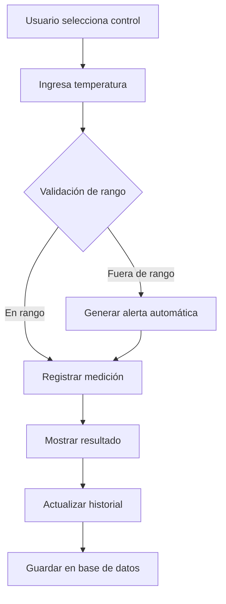
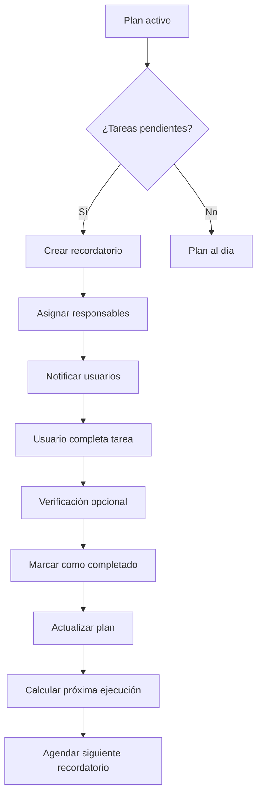
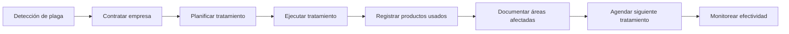
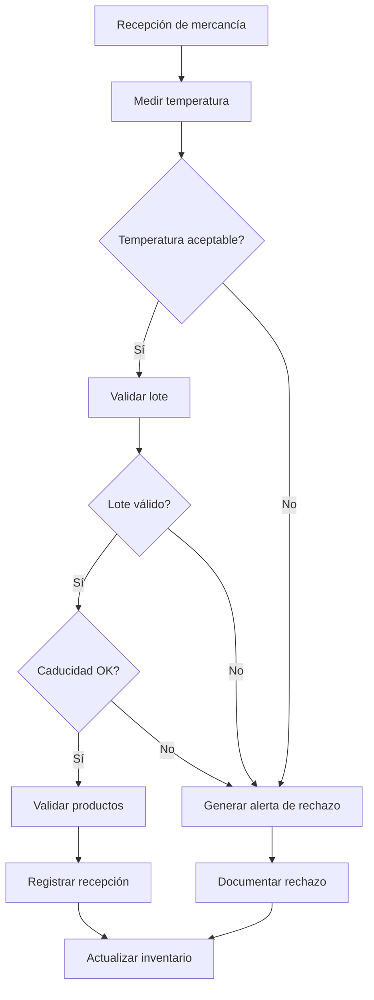
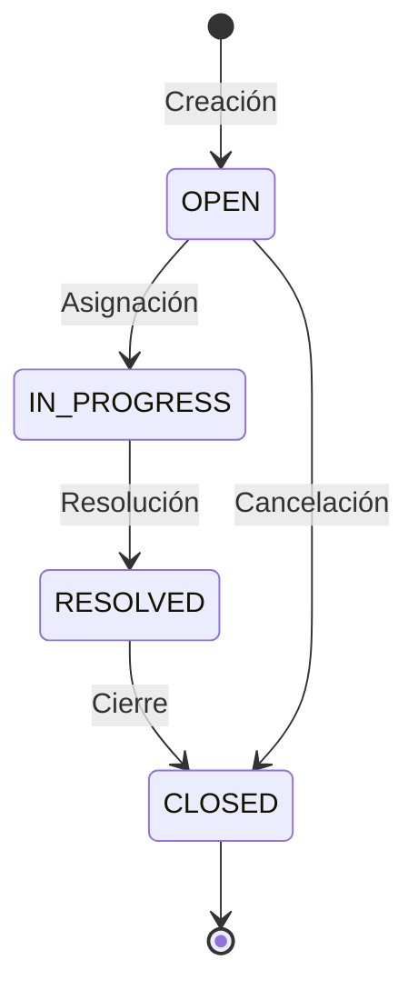

# Arquitectura del Sistema APPCC

## Descripción General

El Sistema APPCC (Análisis de Peligros y Puntos Críticos de Control) de ChefChek proporciona una solución integral para el registro, seguimiento y control de todas las operaciones sanitarias requeridas por la normativa alimentaria. El sistema implementa los 7 principios del APPCC de manera digital, automatizando controles, alertas y reportes de cumplimiento.

## Componentes Principales

```
APPCC System
├── Temperature Control Module
│   ├── Control Points Management
│   ├── Real-time Measurements
│   ├── Range Validation
│   └── Automatic Alerts
├── Cleaning Plan Module
│   ├── Plan Scheduling
│   ├── Task Assignment
│   ├── Completion Tracking
│   └── Reminder System
├── Pest Control Module
│   ├── Treatment Registry
│   ├── Area Mapping
│   ├── Product Tracking
│   └── Follow-up Scheduling
├── Goods Reception Module
│   ├── Temperature Validation
│   ├── Quality Checks
│   ├── Rejection Management
│   └── Compliance Records
├── Alert System
│   ├── Multi-severity Notifications
│   ├── User Assignment
│   ├── Status Tracking
│   └── Response Monitoring
└── Compliance Reporting
    ├── KPI Calculation
    ├── Trend Analysis
    ├── Recommendations
    └── Report Generation
```

## Arquitectura Técnica

### Backend (NestJS)

```
backend/src/modules/appcc/
├── dto/
│   └── appcc.dto.ts                    # DTOs y validaciones
├── appcc.service.ts                    # Lógica de negocio
├── appcc.controller.ts                 # Endpoints RESTful
└── appcc.module.ts                     # Configuración del módulo
```

### Frontend (Next.js)

```
frontend/src/app/dashboard/appcc/
└── page.tsx                            # UI completa del sistema
```

## Módulo de Control de Temperaturas

### Estructura de Datos

```typescript
interface TemperatureControl {
  id: string;
  tenantId: string;
  type: ControlType;                    // CAMERA, EQUIPMENT, PRODUCT
  location: string;
  targetTemperature: number;
  tolerance: number;
  unit: TemperatureUnit;                // CELSIUS, FAHRENHEIT
  description?: string;
  responsible?: string;
  createdAt: Date;
  createdBy: string;
}

interface TemperatureMeasurement {
  id: string;
  controlId: string;
  temperature: number;
  withinRange: boolean;
  recordedAt: Date;
  recordedBy: string;
  notes?: string;
}
```

### Flujo de Control



### Validación de Rango

```typescript
isWithinRange(value: number, target: number, tolerance: number): boolean {
  return value >= target - tolerance && value <= target + tolerance;
}
```

### Tipos de Controles

1. **Cámara (CAMERA)**: Cámaras de refrigeración y congelación
   - Congelación: -18°C ± 2°C
   - Refrigeración: 4°C ± 2°C
   - Mantenimiento: 65°C ± 5°C

2. **Equipo (EQUIPMENT)**: Equipos de cocina
   - Parrillas: 200°C ± 20°C
   - Hornos: 180°C ± 20°C
   - Freidoras: 180°C ± 20°C

3. **Producto (PRODUCT)**: Productos en proceso
   - Cocción: 75°C mínimo
   - Mantenimiento caliente: 65°C mínimo
   - Enfriamiento rápido: de 60°C a 21°C en 2 horas

## Módulo de Planes de Limpieza

### Estructura de Datos

```typescript
interface CleaningPlan {
  id: string;
  tenantId: string;
  name: string;
  frequency: CleaningFrequency;        // DAILY, WEEKLY, MONTHLY, QUARTERLY
  description?: string;
  responsible: string[];
  durationMinutes?: number;
  isActive: boolean;
  lastExecutionAt?: Date;
  createdAt: Date;
  createdBy: string;
  tasks: CleaningTask[];
}

interface CleaningTask {
  id: string;
  planId: string;
  area: string;
  description: string;
  products?: string[];
  estimatedTime?: number;
  responsible?: string[];
  completed: boolean;
  completedAt?: Date;
  verifiedBy?: string;
  notes?: string;
  createdAt: Date;
}
```

### Sistema de Frecuencias

| Frecuencia | Descripción | Cálculo de Próxima Ejecución |
|------------|-------------|------------------------------|
| DAILY | Diario | +1 día |
| WEEKLY | Semanal | +7 días |
| MONTHLY | Mensual | +1 mes |
| QUARTERLY | Trimestral | +3 meses |

### Flujo de Ejecución



### Sistema de Recordatorios

```typescript
async checkCleaningPlanReminders(tenantId: string): Promise<void> {
  const today = new Date();
  today.setHours(0, 0, 0, 0);

  const plans = await this.prisma.cleaningPlan.findMany({
    where: {
      tenantId,
      isActive: true,
    },
    include: {
      tasks: {
        where: {
          completed: false,
        },
      },
    },
  });

  for (const plan of plans) {
    const isDueToday = this.isPlanDueToday(plan, today);

    if (isDueToday) {
      const pendingTasks = plan.tasks.filter((t) => !t.completed);

      if (pendingTasks.length > 0) {
        await this.createCleaningReminder(plan, pendingTasks);
      }
    }
  }
}
```

## Módulo de Control de Plagas

### Estructura de Datos

```typescript
interface PestControl {
  id: string;
  tenantId: string;
  empresa: string;
  type: PestType;                       // RATS, INSECTS, RODENTS, BIRDS
  date: Date;
  nextDate: Date;
  productos: string[];
  areasAfectadas: string[];
  responsable: string;
  notas?: string;
  createdAt: Date;
}
```

### Tipos de Plagas

1. **RATS**: Roedores mayores (ratas)
2. **INSECTS**: Insectos (cucarachas, hormigas, moscas)
3. **RODENTS**: Roedores menores (ratones)
4. **BIRDS**: Aves (palomas, gorriones)

### Flujo de Gestión



## Módulo de Recepción de Mercancías

### Estructura de Datos

```typescript
interface GoodsReception {
  id: string;
  tenantId: string;
  proveedorId: string;
  fecha: Date;
  temperaturaAlRecepcion: number;
  temperaturaAceptable: number;
  lote: string;
  caducidad: Date;
  albaran: string;
  productos: ReceivedProduct[];
  firmadoPor: string;
  verificadoPor: string;
  observaciones?: string;
  createdAt: Date;
}

interface ReceivedProduct {
  productoId: string;
  nombre: string;
  cantidad: number;
  unidad: string;
  temperatura: number;
  estado: 'ACCEPTED' | 'REJECTED' | 'QUARANTINED';
  motivoRechazo?: string;
}
```

### Flujo de Validación



### Reglas de Aceptación

1. **Temperatura**: Debe estar dentro del rango aceptable
2. **Lote**: Debe ser válido y trazable
3. **Caducidad**: No debe estar vencido
4. **Productos**: Cada producto debe cumplir criterios individuales

## Sistema de Alertas

### Estructura de Datos

```typescript
interface Alert {
  id: string;
  tenantId: string;
  severity: AlertSeverity;             // LOW, MEDIUM, HIGH, CRITICAL
  type: string;                        // TEMPERATURE, CLEANING, APPCC, PEST, GOODS_RECEPTION
  title: string;
  message: string;
  entityId?: string;
  status: string;                      // OPEN, IN_PROGRESS, RESOLVED, CLOSED
  assignees?: string[];
  dueDate?: Date;
  createdAt: Date;
  updatedAt?: Date;
  resolvedAt?: Date;
  resolvedBy?: string;
  resolution?: string;
}

interface AlertNotification {
  id: string;
  alertId: string;
  userId: string;
  status: string;                      // PENDING, SENT, READ
  sentAt?: Date;
  readAt?: Date;
}
```

### Niveles de Severidad

| Severidad | Descripción | Tiempo de Respuesta Esperado |
|-----------|-------------|------------------------------|
| CRITICAL | Riesgo inmediato para la salud | 15 minutos |
| HIGH | Riesgo significativo | 30 minutos |
| MEDIUM | Riesgo moderado | 1 hora |
| LOW | Riesgo menor | 4 horas |

### Ciclo de Vida de Alertas



### Generación Automática de Alertas

#### Alertas de Temperatura

```typescript
private async createTemperatureAlert(controlId: string, measurement: any): Promise<void> {
  const control = await this.prisma.temperatureControl.findUnique({
    where: { id: controlId },
  });

  await this.prisma.alert.create({
    data: {
      tenantId: control.tenantId,
      severity: 'HIGH',
      type: 'TEMPERATURE',
      title: `Alerta de Temperatura - ${control.location}`,
      message: `Temperatura ${measurement.temperature}°${control.unit} fuera de rango (${control.targetTemperature}°${control.unit} ± ${control.tolerance}°${control.unit})`,
      entityId: controlId,
      dueDate: new Date(Date.now() + 60 * 60 * 1000), // 1 hora
      status: 'OPEN',
      createdAt: new Date(),
    },
  });
}
```

#### Alertas de Recepción

```typescript
private async createGoodsReceptionAlert(receptionId: string, rejectedProducts: any[]): Promise<void> {
  const reception = await this.prisma.goodsReception.findUnique({
    where: { id: receptionId },
  });

  await this.prisma.alert.create({
    data: {
      tenantId: reception.tenantId,
      severity: 'HIGH',
      type: 'GOODS_RECEPTION',
      title: `Alerta de Recepción - ${reception.albaran}`,
      message: `${rejectedProducts.length} productos rechazados por temperatura fuera de rango`,
      entityId: receptionId,
      dueDate: new Date(Date.now() + 30 * 60 * 1000), // 30 minutos
      status: 'OPEN',
      createdAt: new Date(),
    },
  });
}
```

#### Recordatorios de Limpieza

```typescript
private async createCleaningReminder(plan: any, tasks: any[]): Promise<void> {
  await this.prisma.alert.create({
    data: {
      tenantId: plan.tenantId,
      severity: 'MEDIUM',
      type: 'CLEANING',
      title: `Recordatorio de Limpieza - ${plan.name}`,
      message: `${tasks.length} tareas pendientes del plan "${plan.name}"`,
      entityId: plan.id,
      dueDate: new Date(Date.now() + 24 * 60 * 60 * 1000), // 24 horas
      status: 'OPEN',
      assignees: plan.responsible,
      createdAt: new Date(),
    },
  });
}
```

## Sistema de Reportes de Cumplimiento

### Estructura de Datos

```typescript
interface ComplianceReport {
  id: string;
  tenantId: string;
  period: string;                       // DAILY, WEEKLY, MONTHLY, QUARTERLY
  startDate: Date;
  endDate: Date;
  kpis: ComplianceKPI;
  reportData: ComplianceData;
  recommendations: string[];
  generatedAt: Date;
}

interface ComplianceKPI {
  temperatureCompliance: number;       // Porcentaje de temperaturas en rango
  cleaningCompliance: number;          // Porcentaje de limpieza completada
  pestControlCoverage: number;         // Cobertura de control de plagas
  goodsAcceptanceRate: number;         // Tasa de aceptación de mercancías
  alertResponseTime: number;           // Tiempo promedio de respuesta (minutos)
  overallCompliance: number;           // Cumplimiento general
}

interface ComplianceData {
  temperatures: TemperatureMeasurement[];
  cleaningTasks: CleaningTask[];
  pestControls: PestControl[];
  goodsReceptions: GoodsReception[];
  alerts: Alert[];
}
```

### Cálculo de KPIs

#### Cumplimiento de Temperaturas

```typescript
const totalTemps = data.temperatures.length;
const compliantTemps = data.temperatures.filter((m) => m.withinRange).length;
kpis.temperatureCompliance = totalTemps > 0 ? (compliantTemps / totalTemps) * 100 : 100;
```

#### Cumplimiento de Limpieza

```typescript
const totalTasks = data.cleaningTasks.length;
const completedTasks = totalTasks;
const totalExpectedTasks = this.calculateExpectedCleaningTasks(data.cleaningTasks);
kpis.cleaningCompliance = totalExpectedTasks > 0 ? (completedTasks / totalExpectedTasks) * 100 : 100;
```

#### Tasa de Aceptación de Mercancías

```typescript
const totalProducts = data.goodsReceptions.reduce(
  (sum, reception) => sum + reception.productos.length,
  0
);
const acceptedProducts = data.goodsReceptions.reduce(
  (sum, reception) => sum + reception.productos.filter((p) => p.estado === 'ACCEPTED').length,
  0
);
kpis.goodsAcceptanceRate = totalProducts > 0 ? (acceptedProducts / totalProducts) * 100 : 100;
```

#### Tiempo de Respuesta a Alertas

```typescript
const resolvedAlerts = data.alerts.filter(
  (a) => a.status === 'RESOLVED' || a.status === 'CLOSED'
);
if (resolvedAlerts.length > 0) {
  const totalResponseTime = resolvedAlerts.reduce(
    (sum, alert) => sum + (alert.resolvedAt.getTime() - alert.createdAt.getTime()),
    0
  );
  kpis.alertResponseTime = totalResponseTime / resolvedAlerts.length / (1000 * 60);
}
```

#### Cumplimiento General

```typescript
kpis.overallCompliance =
  (kpis.temperatureCompliance +
    kpis.cleaningCompliance +
    kpis.goodsAcceptanceRate) / 3;
```

### Generación de Recomendaciones

```typescript
private generateRecommendations(data: any, kpis: any): string[] {
  const recommendations: string[] = [];

  if (kpis.temperatureCompliance < 90) {
    recommendations.push(
      '⚠️ Mejorar control de temperaturas. Considera aumentar frecuencia de monitoreo.'
    );
  }

  if (kpis.cleaningCompliance < 90) {
    recommendations.push(
      '🧹 Revisar cumplimiento de planes de limpieza. Ajustar frecuencia o responsables.'
    );
  }

  if (kpis.goodsAcceptanceRate < 90) {
    recommendations.push(
      '📦 Revisar proceso de recepción de mercancías. Capacitar personal en controles.'
    );
  }

  if (kpis.alertResponseTime > 60) {
    recommendations.push(
      '⏱️ Tiempo de respuesta a alertas excesivo. Implementar sistema de notificaciones.'
    );
  }

  const temperatureIssues = data.temperatures.filter((m) => !m.withinRange);
  if (temperatureIssues.length > 5) {
    recommendations.push(
      '🌡️ Múltiples incidencias de temperatura detectadas. Revisar equipos y cámaras.'
    );
  }

  return recommendations;
}
```

## API Endpoints

### Control de Temperaturas

- `POST /api/v1/appcc/temperature-controls` - Crear control de temperatura
- `POST /api/v1/appcc/temperature-controls/:controlId/record` - Registrar temperatura
- `GET /api/v1/appcc/temperature-controls` - Listar controles
- `GET /api/v1/appcc/temperature-controls/:controlId/measurements` - Historial de mediciones

### Planes de Limpieza

- `POST /api/v1/appcc/cleaning-plans` - Crear plan de limpieza
- `POST /api/v1/appcc/cleaning-plans/:planId/tasks` - Agregar tarea
- `PUT /api/v1/appcc/cleaning-tasks/:taskId/complete` - Completar tarea
- `GET /api/v1/appcc/cleaning-plans` - Listar planes

### Control de Plagas

- `POST /api/v1/appcc/pest-controls` - Crear registro de control
- `GET /api/v1/appcc/pest-controls` - Listar registros

### Recepción de Mercancías

- `POST /api/v1/appcc/goods-reception` - Registrar recepción
- `GET /api/v1/appcc/goods-reception` - Listar recepciones

### Alertas

- `POST /api/v1/appcc/alerts` - Crear alerta
- `PUT /api/v1/appcc/alerts/:alertId` - Actualizar alerta
- `GET /api/v1/appcc/alerts` - Listar alertas (con filtros)

### Reportes de Cumplimiento

- `POST /api/v1/appcc/compliance-reports` - Generar reporte
- `GET /api/v1/appcc/compliance-reports/history` - Historial de reportes

## Seguridad y Autorización

### Roles y Permisos

| Rol | Permisos |
|-----|----------|
| ADMIN | Todos los permisos (CRUD completo) |
| USER | Creación, lectura, actualización (sin eliminar) |
| VIEWER | Solo lectura |

### Protección de Rutas

```typescript
@UseGuards(JwtAuthGuard, RolesGuard)
@Roles('ADMIN', 'USER')
async createTemperatureControl(...) { }

@UseGuards(JwtAuthGuard, RolesGuard)
@Roles('ADMIN', 'USER', 'VIEWER')
async getTemperatureControls(...) { }
```

## Integración con Otros Módulos

### Inventario

- Recepciones actualizan stock
- Alertas de stock bajo integradas
- Trazabilidad de productos

### Proveedores

- Validación de proveedores en recepciones
- Histórico de calidad por proveedor
- Reportes de cumplimiento por proveedor

### Alérgenos

- Validación de productos en recepciones
- Alertas de contaminación cruzada
- Trazabilidad de alérgenos

## Testing

### Testing Unitario

```typescript
describe('AppccService', () => {
  describe('isWithinRange', () => {
    it('should return true for temperature within range', () => {
      const result = service.isWithinRange(18, 18, 2);
      expect(result).toBe(true);
    });

    it('should return false for temperature outside range', () => {
      const result = service.isWithinRange(16, 18, 1);
      expect(result).toBe(false);
    });
  });
});
```

### Testing de Integración

```typescript
describe('Temperature Control Flow', () => {
  it('should create alert when temperature is out of range', async () => {
    const control = await createTemperatureControl();
    const measurement = await recordTemperature(control.id, 25); // Out of range

    const alerts = await getAlerts({ type: 'TEMPERATURE' });
    expect(alerts.length).toBeGreaterThan(0);
  });
});
```

## Optimización y Performance

### Indexación de Base de Datos

```prisma
model TemperatureMeasurement {
  id        String   @id @default(cuid())
  controlId String
  recordedAt DateTime
  withinRange Boolean

  @@index([controlId])
  @@index([recordedAt])
  @@index([withinRange])
}
```

### Caching

- Caché de controles de temperatura frecuentes
- Caché de planes de limpieza activos
- Caché de KPIs calculados por período

### Paginación

```typescript
async getTemperatureMeasurements(controlId: string): Promise<any[]> {
  return await this.prisma.temperatureMeasurement.findMany({
    where: { controlId },
    orderBy: { recordedAt: 'desc' },
    take: 100,
  });
}
```

## Monitoreo y Logging

### Métricas Clave

- Número de registros de temperatura por día
- Tasa de alertas generadas por tipo
- Tiempo promedio de respuesta a alertas
- Porcentaje de cumplimiento por módulo
- Número de recordatorios enviados

### Eventos de Logging

- Creación de controles
- Registro de temperaturas
- Generación de alertas
- Completado de tareas de limpieza
- Generación de reportes

## Conclusión

El sistema APPCC de ChefChek proporciona una solución completa y digital para el control sanitario alimentario, implementando los 7 principios del APPCC con automatización, alertas en tiempo real y reportes de cumplimiento exhaustivos. La arquitectura modular permite fácil integración con otros módulos del sistema y escalabilidad para futuras funcionalidades.