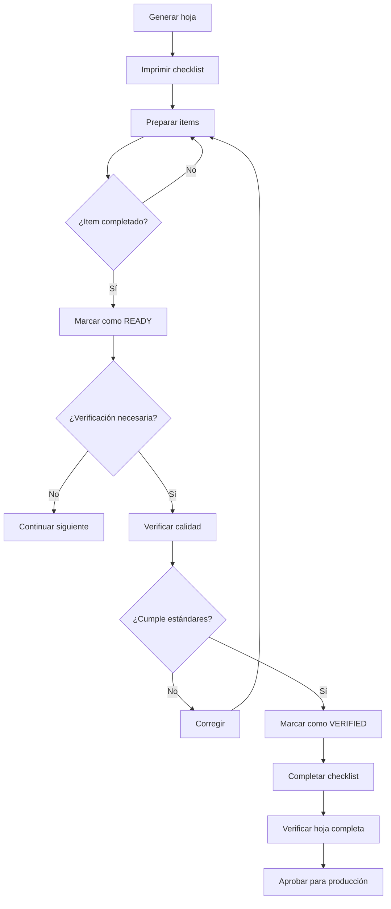

# Sistema de Gestión de Mise en Place

## Descripción General

El sistema de Mise en Place de ChefChek proporciona un control completo y detallado de todas las preparaciones previas necesarias para la producción eficiente. Permite organizar, verificar y documentar cada paso del proceso de preparación antes del inicio de la producción real.

## Concepto de Mise en Place

### Definición

**Mise en place** (pronunciado "miz-on-plas") es un término francés que significa "poner en su lugar". En la cocina profesional, se refiere a la preparación y organización de todos los ingredientes, herramientas y equipos necesarios antes de comenzar la producción.

### Componentes Esenciales

```
Mise en Place
├── Organización de Espacio
│   ├── Limpieza del área de trabajo
│   ├── Organización de herramientas
│   ├── Disposición de equipos
│   └── Flujo de trabajo óptimo
├── Preparación de Ingredientes
│   ├── Lavado y limpieza
│   ├── Pelado y cortado
│   ├── Pesado y medición
│   ├── Maridaje de sabores
│   └── Almacenamiento temporal
├── Equipos y Herramientas
│   ├── Verificación de disponibilidad
│   ├── Preparación de utensilios
│   ├── Calibración de equipos
│   └── Organización por uso
├── Checklists de Verificación
│   ├── Equipos y herramientas
│   ├── Ingredientes y cantidades
│   ├── Temperaturas y tiempos
│   └── Higiene y seguridad
└── Controles de Calidad
    ├── Verificación visual
    ├── Pruebas de temperatura
    ├── Controles de textura
    └── Validación de sabor
```

## Estructura de Datos

### Hoja de Mise en Place

```typescript
interface MiseEnPlaceSheet {
  // Identificación
  id: string;
  batchId: string;
  orderId: string;
  
  // Contexto
  zone: KitchenZone;
  recipeName: string;
  quantity: number;
  unit: string;
  
  // Componentes
  items: MiseEnPlaceItem[];
  checklists: MiseEnPlaceChecklist[];
  qualityChecks: QualityCheck[];
  
  // Estado
  printedAt?: Date;
  completedAt?: Date;
  verifiedBy?: string;
  
  // Metadatos
  createdAt: Date;
  updatedAt?: Date;
}
```

### Items de Preparación

```typescript
interface MiseEnPlaceItem {
  id: string;
  orderId: string;
  
  // Descripción
  description: string;
  category: 'INGREDIENT' | 'PREPARATION' | 'EQUIPMENT' | 'TOOL';
  
  // Cantidad
  quantity: number;
  unit: string;
  batchSize?: number;                  // Cantidad total para el batch
  
  // Estado
  status: 'PENDING' | 'IN_PROGRESS' | 'READY' | 'VERIFIED' | 'ISSUE';
  
  // Temporización
  estimatedTime?: number;
  actualTime?: number;
  completedAt?: Date;
  
  // Calidad
  qualityNotes?: string;
  photos?: string[];
  
  // Dependencias
  dependsOn?: string[];
  
  // Metadatos
  createdAt: Date;
  updatedAt?: Date;
  createdBy?: string;
  completedBy?: string;
}
```

### Checklists

```typescript
interface MiseEnPlaceChecklist {
  id: string;
  sheetId: string;
  
  // Item del checklist
  item: string;
  description: string;
  category: ChecklistCategory;
  
  // Estado
  checked: boolean;
  checkedBy?: string;
  checkedAt?: Date;
  
  // Detalles adicionales
  notes?: string;
  photo?: string;
  issue?: string;
  
  // Prioridad
  priority: 'LOW' | 'MEDIUM' | 'HIGH' | 'CRITICAL';
  
  // Metadatos
  createdAt: Date;
  updatedAt?: Date;
}

enum ChecklistCategory {
  EQUIPMENT = 'EQUIPMENT',               // Equipos y herramientas
  INGREDIENTS = 'INGREDIENTS',           // Ingredientes y cantidades
  TOOLS = 'TOOLS',                       // Utensilios específicos
  SANITATION = 'SANITATION',             // Higiene y seguridad
}
```

### Controles de Calidad

```typescript
interface QualityCheck {
  id: string;
  sheetId: string;
  
  // Parámetro
  parameter: string;
  description: string;
  category: 'VISUAL' | 'TEMPERATURE' | 'TEXTURE' | 'FLAVOR' | 'WEIGHT' | 'VOLUME';
  
  // Valores esperados y reales
  expectedValue: string;
  expectedUnit?: string;
  actualValue: string;
  actualUnit?: string;
  
  // Evaluación
  isCompliant: boolean;
  tolerance?: number;
  
  // Documentación
  checkedBy: string;
  checkedAt: Date;
  notes?: string;
  photos?: string[];
  
  // Acción correctiva si no cumple
  correctiveAction?: string;
  resolvedAt?: Date;
  resolvedBy?: string;
  
  // Metadatos
  createdAt: Date;
  updatedAt?: Date;
}
```

## Proceso de Generación de Hoja

### Algoritmo de Generación

```typescript
async generateMiseEnPlaceSheet(
  orderId: string,
  zone: KitchenZone
): Promise<MiseEnPlaceSheet> {
  // Step 1: Get order details
  const order = await this.prisma.productionOrder.findUnique({
    where: { id: orderId },
    include: {
      miseEnPlaceItems: true,
    },
  });

  if (!order) {
    throw new NotFoundException('Production order not found');
  }

  // Step 2: Get recipe details
  const recipe = await this.getRecipe(order.recipeId);

  // Step 3: Generate preparation items
  const items = await this.generatePreparationItems(recipe, order);

  // Step 4: Generate checklists
  const checklists = await this.generateChecklists(zone, items);

  // Step 5: Create sheet
  const sheet = await this.prisma.miseEnPlaceSheet.create({
    data: {
      batchId: order.batchId,
      orderId,
      zone,
      items: items,
      checklists: checklists.map(c => ({
        ...c,
        checked: false,
      })),
    },
  });

  return sheet;
}

private async generatePreparationItems(
  recipe: Recipe,
  order: ProductionOrder
): Promise<MiseEnPlaceItem[]> {
  const items: MiseEnPlaceItem[] = [];
  const batchSize = order.quantity;

  // Generate ingredient preparation items
  for (const ingredient of recipe.ingredients) {
    const prepSteps = this.getPreparationSteps(ingredient);

    for (const step of prepSteps) {
      items.push({
        id: `item-${Date.now()}-${Math.random()}`,
        orderId: order.id,
        description: step.description,
        category: 'INGREDIENT',
        quantity: step.quantity * batchSize,
        unit: step.unit,
        batchSize,
        estimatedTime: step.estimatedTime,
        status: 'PENDING',
        createdAt: new Date(),
      });
    }
  }

  // Generate equipment preparation items
  const equipment = await this.getRequiredEquipment(recipe);
  for (const eq of equipment) {
    items.push({
      id: `item-${Date.now()}-${Math.random()}`,
      orderId: order.id,
      description: `Preparar ${eq.name}`,
      category: 'EQUIPMENT',
      quantity: 1,
      unit: 'unidad',
      estimatedTime: eq.preparationTime,
      status: 'PENDING',
      createdAt: new Date(),
    });
  }

  // Sort by dependencies and priority
  return this.sortItemsByPriority(items);
}

private async generateChecklists(
  zone: KitchenZone,
  items: MiseEnPlaceItem[]
): Promise<MiseEnPlaceChecklist[]> {
  const checklists: MiseEnPlaceChecklist[] = [];

  // Equipment checklist
  const equipmentItems = items.filter(i => i.category === 'EQUIPMENT');
  for (const item of equipmentItems) {
    checklists.push({
      id: `checklist-${Date.now()}-${Math.random()}`,
      sheetId: '', // Will be set when creating sheet
      item: item.description,
      description: `Verificar estado y disponibilidad`,
      category: 'EQUIPMENT',
      checked: false,
      priority: 'HIGH',
      createdAt: new Date(),
    });
  }

  // Ingredients checklist
  const ingredientItems = items.filter(i => i.category === 'INGREDIENT');
  for (const item of ingredientItems) {
    checklists.push({
      id: `checklist-${Date.now()}-${Math.random()}`,
      sheetId: '',
      item: item.description,
      description: `Verificar cantidad y calidad (${item.quantity} ${item.unit})`,
      category: 'INGREDIENTS',
      checked: false,
      priority: 'MEDIUM',
      createdAt: new Date(),
    });
  }

  // Tools checklist
  checklists.push({
    id: `checklist-${Date.now()}-${Math.random()}`,
    sheetId: '',
    item: 'Herramientas básicas',
    description: 'Cuchillos afilados, tablas de corte, recipientes',
    category: 'TOOLS',
    checked: false,
    priority: 'HIGH',
    createdAt: new Date(),
  });

  // Sanitation checklist
  checklists.push({
    id: `checklist-${Date.now()}-${Math.random()}`,
    sheetId: '',
    item: 'Higiene y seguridad',
    description: 'Uniformes limpios, guantes, area desinfectada',
    category: 'SANITATION',
    checked: false,
    priority: 'CRITICAL',
    createdAt: new Date(),
  });

  return checklists;
}
```

## Sistema de Verificación

### Proceso de Verificación



### Algoritmo de Verificación

```typescript
async verifyMiseEnPlaceSheet(
  sheetId: string,
  userId: string
): Promise<MiseEnPlaceSheet> {
  const sheet = await this.prisma.miseEnPlaceSheet.findUnique({
    where: { id: sheetId },
    include: {
      items: true,
      checklists: true,
      qualityChecks: true,
    },
  });

  if (!sheet) {
    throw new NotFoundException('Mise en place sheet not found');
  }

  // Step 1: Verify all items are ready
  const pendingItems = sheet.items.filter(i => i.status !== 'VERIFIED');
  if (pendingItems.length > 0) {
    throw new BadRequestException(
      `${pendingItems.length} items still pending verification`
    );
  }

  // Step 2: Verify all checklists completed
  const pendingChecklists = sheet.checklists.filter(c => !c.checked);
  if (pendingChecklists.length > 0) {
    throw new BadRequestException(
      `${pendingChecklists.length} checklist items not checked`
    );
  }

  // Step 3: Verify all quality checks passed
  const failedChecks = sheet.qualityChecks.filter(qc => !qc.isCompliant);
  if (failedChecks.length > 0) {
    throw new BadRequestException(
      `${failedChecks.length} quality checks failed`
    );
  }

  // Step 4: Mark sheet as verified
  const updatedSheet = await this.prisma.miseEnPlaceSheet.update({
    where: { id: sheetId },
    data: {
      completedAt: new Date(),
      verifiedBy: userId,
    },
  });

  return updatedSheet;
}
```

### Controles de Calidad Automáticos

```typescript
interface QualityControlRule {
  id: string;
  parameter: string;
  category: string;
  condition: (item: MiseEnPlaceItem, sheet: MiseEnPlaceSheet) => boolean;
  severity: 'LOW' | 'MEDIUM' | 'HIGH' | 'CRITICAL';
  action: string;
}

const qualityControlRules: QualityControlRule[] = [
  {
    id: 'qc-001',
    parameter: 'Temperatura de ingredientes perecederos',
    category: 'TEMPERATURE',
    condition: (item, sheet) => {
      if (item.category === 'INGREDIENT' && item.description.includes('fresco')) {
        return item.temperature && item.temperature > 7;
      }
      return false;
    },
    severity: 'HIGH',
    action: 'Enfriar ingrediente o marcar como no adecuado',
  },
  {
    id: 'qc-002',
    parameter: 'Tiempo de preparación excedido',
    category: 'TIME',
    condition: (item, sheet) => {
      if (item.estimatedTime && item.actualTime) {
        return item.actualTime > item.estimatedTime * 1.5;
      }
      return false;
    },
    severity: 'MEDIUM',
    action: 'Investigar causa del retraso',
  },
  {
    id: 'qc-003',
    parameter: 'Cantidad insuficiente',
    category: 'QUANTITY',
    condition: (item, sheet) => {
      if (item.quantity && item.batchSize && item.actualQuantity) {
        return item.actualQuantity < item.batchSize;
      }
      return false;
    },
    severity: 'CRITICAL',
    action: 'Alertar inmediatamente, ajustar cantidad',
  },
];

async applyQualityControls(sheetId: string): Promise<QualityCheck[]> {
  const sheet = await this.prisma.miseEnPlaceSheet.findUnique({
    where: { id: sheetId },
    include: {
      items: true,
    },
  });

  if (!sheet) {
    throw new NotFoundException('Mise en place sheet not found');
  }

  const qualityChecks: QualityCheck[] = [];

  for (const item of sheet.items) {
    for (const rule of qualityControlRules) {
      if (rule.condition(item, sheet)) {
        const check = await this.prisma.qualityCheck.create({
          data: {
            sheetId,
            parameter: rule.parameter,
            description: rule.condition.toString(),
            category: rule.category,
            expectedValue: 'Cumple estándares',
            actualValue: 'No cumple',
            isCompliant: false,
            checkedBy: 'SYSTEM',
            checkedAt: new Date(),
            correctiveAction: rule.action,
          },
        });

        qualityChecks.push(check);
      }
    }
  }

  return qualityChecks;
}
```

## Categorías de Preparación

### Por Tipo de Ingrediente

```typescript
enum IngredientCategory {
  VEGETABLES = 'VEGETABLES',           // Vegetales y hortalizas
  FRUITS = 'FRUITS',                   // Frutas
  MEAT = 'MEAT',                       // Carnes
  FISH = 'FISH',                       // Pescados
  DAIRY = 'DAIRY',                     // Lácteos
  DRY_GOODS = 'DRY_GOODS',             // Secos
  SPICES = 'SPICES',                   // Especias y hierbas
  OILS = 'OILS',                       // Aceites
  SAUCES = 'SAUCES',                   // Salsas
  PREPARED = 'PREPARED',               // Preparados
}
```

### Por Método de Preparación

```typescript
enum PreparationMethod {
  WASH = 'WASH',                       // Lavado
  PEEL = 'PEEL',                       // Pelado
  CHOP = 'CHOP',                       // Picado
  DICE = 'DICE',                       // Cortado en dados
  SLICE = 'SLICE',                     // Cortado en láminas
  JULIENNE = 'JULIENNE',               // Cortado en juliana
  MINCE = 'MINCE',                     // Picado fino
  GRIND = 'GRIND',                     // Molido
  MARINATE = 'MARINATE',               // Marinado
  SEASON = 'SEASON',                   // Sazonar
  COOK = 'COOK',                       // Cocinar previamente
  BLANCH = 'BLANCH',                   // Escaldar
  ROAST = 'ROAST',                     // Asar previamente
}
```

### Pasos de Preparación por Categoría

#### Vegetales y Hortalizas

```
1. LAVAR
   - Remover tierra visible
   - Lavar con agua fría
   - Usar vegetales apropiados si necesario
   
2. PELAR (si aplica)
   - Usar pelador afilado
   - Retirar partes dañadas
   - Mantener forma uniforme
   
3. CORTAR
   - Técnica según receta
   - Tamaño uniforme
   - Guardar consistencia
   
4. ALMACENAR
   - Contenedor apropiado
   - Etiquetar con fecha
   - Refrigerar si es necesario
```

#### Carnes

```
1. INSPECCIONAR
   - Verificar frescura
   - Chequear color y olor
   - Retirar grasas excesivas
   
2. PREPARAR
   - Cortar según receta
   - Retirar tendones y membranas
   - Dar forma uniforme
   
3. MARINAR (si aplica)
   - Aplicar marinada
   - Tiempo según receta
   - Refrigerar durante marinado
   
4. ALMACENAR
   - Contenedor hermético
   - Etiquetar con fecha
   - Refrigerar inmediatamente
```

#### Pescados

```
1. VERIFICAR FRESCURA
   - Chequear olor
   - Verificar color
   - Probar textura
   
2. PREPARAR
   - Limpiar y filetear
   - Retirar espinas
   - Cortar porciónes
   
3. ALMACENAR
   - Sobre hielo si se usa pronto
   - Refrigerar inmediatamente
   - Usar en 24 horas máximo
```

## Sistema de Tiempos de Preparación

### Estimación por Técnica

```typescript
interface PreparationTimeEstimate {
  technique: PreparationMethod;
  baseTime: number;                     // minutos por kg
  complexityFactor: number;
  totalTime: number;
}

const preparationTimeEstimates: PreparationTimeEstimate[] = [
  {
    technique: 'WASH',
    baseTime: 2,
    complexityFactor: 1.0,
    totalTime: 2,
  },
  {
    technique: 'PEEL',
    baseTime: 5,
    complexityFactor: 1.2,
    totalTime: 6,
  },
  {
    technique: 'CHOP',
    baseTime: 3,
    complexityFactor: 1.0,
    totalTime: 3,
  },
  {
    technique: 'DICE',
    baseTime: 4,
    complexityFactor: 1.3,
    totalTime: 5.2,
  },
  {
    technique: 'SLICE',
    baseTime: 3,
    complexityFactor: 1.1,
    totalTime: 3.3,
  },
  {
    technique: 'JULIENNE',
    baseTime: 6,
    complexityFactor: 1.5,
    totalTime: 9,
  },
  {
    technique: 'MINCE',
    baseTime: 4,
    complexityFactor: 1.4,
    totalTime: 5.6,
  },
  {
    technique: 'MARINATE',
    baseTime: 0,
    complexityFactor: 0,
    totalTime: 0, // Marinado es tiempo de espera, no preparación
  },
];

function estimatePreparationTime(
  technique: PreparationMethod,
  quantity: number,
  complexity: 'SIMPLE' | 'MODERATE' | 'COMPLEX'
): number {
  const estimate = preparationTimeEstimates.find(e => e.technique === technique);
  if (!estimate) return 10; // Default time

  const complexityFactor = {
    SIMPLE: 1.0,
    MODERATE: 1.2,
    COMPLEX: 1.5,
  };

  return estimate.baseTime * quantity * complexityFactor[complexity];
}
```

### Comparación Tiempos Estimados vs Reales

```typescript
interface TimeAnalysis {
  technique: PreparationMethod;
  ingredient: string;
  estimatedTime: number;
  actualTime: number;
  difference: number;
  percentageDifference: number;
  efficiency: number;
  recommendations: string[];
}

async analyzePreparationEfficiency(
  sheetId: string
): Promise<TimeAnalysis[]> {
  const sheet = await this.prisma.miseEnPlaceSheet.findUnique({
    where: { id: sheetId },
    include: {
      items: true,
    },
  });

  const analyses: TimeAnalysis[] = [];

  for (const item of sheet.items) {
    if (item.estimatedTime && item.actualTime) {
      const estimatedTime = item.estimatedTime;
      const actualTime = item.actualTime;
      const difference = actualTime - estimatedTime;
      const percentageDifference = (difference / estimatedTime) * 100;
      const efficiency = (estimatedTime / actualTime) * 100;

      const recommendations = this.generateTimeRecommendations(
        percentageDifference,
        item
      );

      analyses.push({
        technique: this.extractTechnique(item.description),
        ingredient: item.description,
        estimatedTime,
        actualTime,
        difference,
        percentageDifference,
        efficiency,
        recommendations,
      });
    }
  }

  return analyses.sort((a, b) => a.efficiency - b.efficiency);
}

private generateTimeRecommendations(
  percentageDiff: number,
  item: MiseEnPlaceItem
): string[] {
  const recommendations: string[] = [];

  if (percentageDiff > 20) {
    recommendations.push('Considerar técnicas más eficientes');
    recommendations.push('Capacitar al personal en técnicas específicas');
  } else if (percentageDiff > 10) {
    recommendations.push('Revisar técnica de preparación');
    recommendations.push('Optimizar flujo de trabajo');
  } else if (percentageDiff < -10) {
    recommendations.push('Excelente desempeño, documentar técnica');
    recommendations.push('Compartir mejores prácticas con equipo');
  }

  return recommendations;
}
```

## Integración con Otros Sistemas

### Inventario

```typescript
async checkIngredientAvailability(
  items: MiseEnPlaceItem[]
): Promise<AvailabilityCheck[]> {
  const checks: AvailabilityCheck[] = [];

  for (const item of items) {
    if (item.category === 'INGREDIENT') {
      const ingredient = await this.prisma.product.findFirst({
        where: { name: { contains: item.description } },
      });

      if (ingredient) {
        const available = ingredient.stock >= item.quantity;
        const check: AvailabilityCheck = {
          ingredient: item.description,
          required: item.quantity,
          available: available ? ingredient.stock : 0,
          isAvailable: available,
          urgency: available ? 'LOW' : 'HIGH',
          action: available ? '' : 'Solicitar inmediatamente',
        };

        checks.push(check);
      }
    }
  }

  return checks;
}
```

### Recetas

```typescript
async getMiseEnPlaceFromRecipe(recipeId: string): Promise<MiseEnPlaceTemplate> {
  const recipe = await this.prisma.recipe.findUnique({
    where: { id: recipeId },
    include: {
      ingredients: true,
    },
  });

  if (!recipe) {
    throw new NotFoundException('Recipe not found');
  }

  const template: MiseEnPlaceTemplate = {
    recipeId,
    recipeName: recipe.name,
    ingredients: recipe.ingredients.map(ing => ({
      name: ing.name,
      quantity: ing.quantity,
      unit: ing.unit,
      preparationSteps: this.getPreparationSteps(ing),
      equipment: this.getRequiredEquipmentForIngredient(ing),
      qualityChecks: this.getQualityChecksForIngredient(ing),
    })),
    equipment: this.getAllRequiredEquipment(recipe),
    totalTime: recipe.preparationTime,
  };

  return template;
}
```

## Métricas de Mise en Place

### KPIs de Eficiencia

```typescript
interface MiseEnPlaceKPIs {
  totalSheets: number;
  completedSheets: number;
  averagePreparationTime: number;
  averageChecklistCompliance: number;
  averageQualityScore: number;
  onTimeCompletionRate: number;
  itemEfficiencyRate: number;
}

async calculateMiseEnPlaceKPIs(
  startDate: Date,
  endDate: Date
): Promise<MiseEnPlaceKPIs> {
  const sheets = await this.prisma.miseEnPlaceSheet.findMany({
    where: {
      completedAt: {
        gte: startDate,
        lte: endDate,
      },
    },
    include: {
      items: true,
      checklists: true,
      qualityChecks: true,
    },
  });

  const kpis: MiseEnPlaceKPIs = {
    totalSheets: sheets.length,
    completedSheets: sheets.length,
    averagePreparationTime: 0,
    averageChecklistCompliance: 0,
    averageQualityScore: 0,
    onTimeCompletionRate: 0,
    itemEfficiencyRate: 0,
  };

  // Calculate average preparation time
  const completedItems = sheets.flatMap(s => s.items.filter(i => i.actualTime));
  if (completedItems.length > 0) {
    kpis.averagePreparationTime = completedItems.reduce(
      (sum, i) => sum + i.actualTime,
      0
    ) / completedItems.length;
  }

  // Calculate checklist compliance
  const allChecklistItems = sheets.flatMap(s => s.checklists);
  if (allChecklistItems.length > 0) {
    const checkedItems = allChecklistItems.filter(c => c.checked);
    kpis.averageChecklistCompliance = (checkedItems.length / allChecklistItems.length) * 100;
  }

  // Calculate quality score
  const allQualityChecks = sheets.flatMap(s => s.qualityChecks);
  if (allQualityChecks.length > 0) {
    const compliantChecks = allQualityChecks.filter(qc => qc.isCompliant);
    kpis.averageQualityScore = (compliantChecks.length / allQualityChecks.length) * 100;
  }

  // Calculate item efficiency
  const itemsWithTimes = completedItems.filter(i => i.estimatedTime && i.actualTime);
  if (itemsWithTimes.length > 0) {
    const totalEstimated = itemsWithTimes.reduce((sum, i) => sum + i.estimatedTime, 0);
    const totalActual = itemsWithTimes.reduce((sum, i) => sum + i.actualTime, 0);
    kpis.itemEfficiencyRate = (totalEstimated / totalActual) * 100;
  }

  return kpis;
}
```

## Conclusión

El sistema de gestión de Mise en Place proporciona un control completo y detallado de todas las preparaciones previas necesarias para la producción eficiente. Con hojas automatizadas, checklists de verificación, controles de calidad y análisis de eficiencia, el sistema garantiza que todo esté perfectamente preparado antes de iniciar la producción, maximizando la calidad y minimizando el desperdicio.