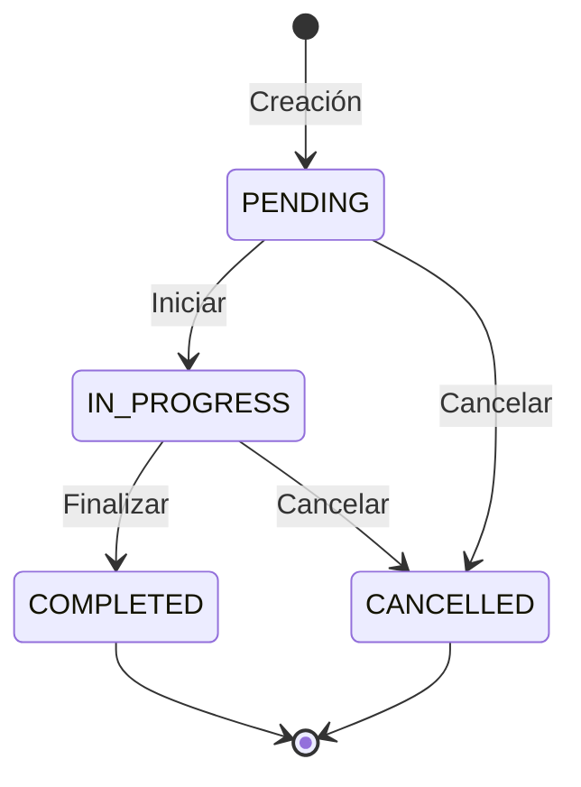
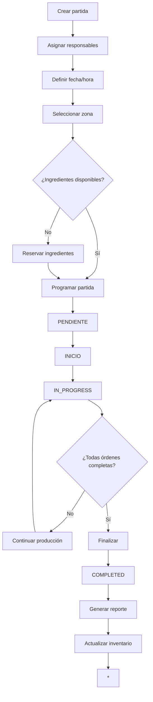
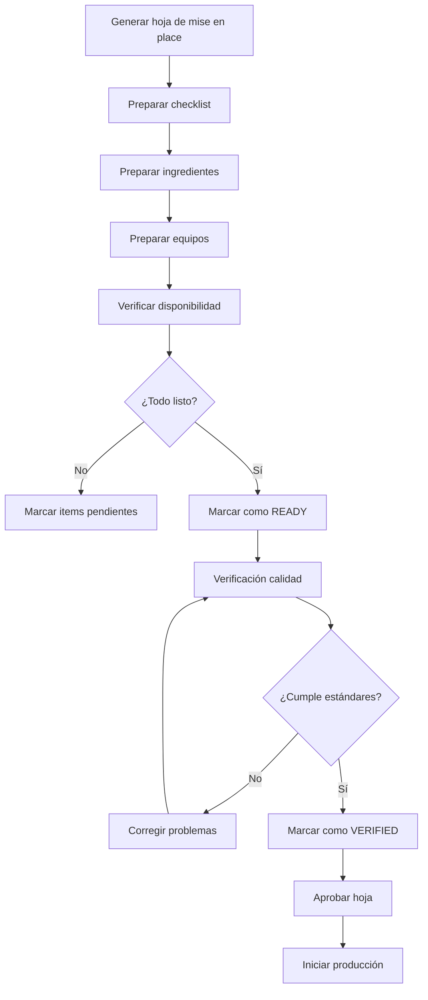

# Sistema de Control de Producción

## Descripción General

El Sistema de Control de Producción de ChefChek proporciona una solución integral para gestionar partidas de trabajo, asignación de tareas, seguimiento de progreso y optimización de la eficiencia en cocinas profesionales. El sistema organiza la producción por zonas de cocina y automatiza el flujo desde la planificación hasta la finalización.

## Componentes Principales

```
Sistema de Control de Producción
├── Partidas de Trabajo (Work Batches)
│   ├── Gestión de partidas
│   ├── Programación por fecha/hora
│   ├── Asignación de responsables
│   └── Organización por zonas
├── Órdenes de Producción
│   ├── Recetas a producir
│   ├── Cálculo de ingredientes
│   ├── Estimación de tiempos
│   └── Seguimiento de estado
├── Mise en Place
│   ├── Listas de preparación
│   ├── Checklists por categorías
│   ├── Verificación de calidad
│   └── Control de inventario
├── Asignación de Tareas
│   ├── Distribución de carga
│   ├── Asignación por habilidades
│   ├── Gestión de dependencias
│   └── Balanceo de recursos
├── Seguimiento de Progreso
│   ├── Indicadores en tiempo real
│   ├── Hitos y checkpoints
│   ├── Alertas automáticas
│   └── Predicción de retrasos
└── Reportes de Producción
    ├── KPIs de rendimiento
    ├── Análisis de eficiencia
    ├── Utilización de recursos
    └── Identificación de mejoras
```

## Arquitectura Técnica

### Backend (NestJS)

```
backend/src/modules/production/
├── dto/
│   └── production.dto.ts              # DTOs y enums
├── production.service.ts              # Lógica de negocio
├── production.controller.ts           # Endpoints RESTful
└── production.module.ts               # Configuración del módulo
```

### Frontend (Next.js)

```
frontend/src/app/dashboard/production/
└── page.tsx                           # UI completa del sistema
```

## Partidas de Trabajo (Work Batches)

### Estructura de Datos

```typescript
interface WorkBatch {
  id: string;
  tenantId: string;
  name: string;
  description?: string;
  scheduledDate: Date;
  scheduledTime: string;
  status: 'PENDING' | 'IN_PROGRESS' | 'COMPLETED' | 'CANCELLED';
  priority: 'LOW' | 'MEDIUM' | 'HIGH' | 'URGENT';
  responsible: string[];
  kitchenZone: KitchenZone;
  productionOrders: ProductionOrder[];
  createdAt: Date;
  createdBy: string;
  startedAt?: Date;
  completedAt?: Date;
}
```

### Estados de Partida



### Prioridades

| Prioridad | Uso | Tiempo de Respuesta Esperado |
|-----------|-----|------------------------------|
| LOW | Producción rutina, sin presión | 1 hora |
| MEDIUM | Producción regular | 30 minutos |
| HIGH | Servicio importante, eventos | 15 minutos |
| URGENT | Situaciones críticas, emergencias | 5 minutos |

### Zonas de Cocina

```typescript
enum KitchenZone {
  HOT_KITCHEN = 'HOT_KITCHEN',           // Cocinado caliente
  COLD_KITCHEN = 'COLD_KITCHEN',         // Preparación fría
  PASTRY_KITCHEN = 'PASTRY_KITCHEN',     // Pastelería
  GRILL_STATION = 'GRILL_STATION',       // Parrilla
  FRYING_STATION = 'FRYING_STATION',     // Freidora
  PLATING_STATION = 'PLATING_STATION',   // Emplatado
  SERVICE_STATION = 'SERVICE_STATION',   // Servicio
}
```

### Flujo de Gestión



## Órdenes de Producción

### Estructura de Datos

```typescript
interface ProductionOrder {
  id: string;
  batchId: string;
  recipeId: string;
  recipeName: string;
  quantity: number;
  unit: string;
  ingredients: ProductionIngredient[];
  estimatedTime: number;                // en minutos
  actualTime?: number;                  // tiempo real en minutos
  status: 'PENDING' | 'IN_PROGRESS' | 'COMPLETED';
  miseEnPlaceItems: MiseEnPlaceItem[];
  createdAt: Date;
}

interface ProductionIngredient {
  productId: string;
  productName: string;
  quantity: number;
  unit: string;
  isAvailable: boolean;
  reserved: boolean;
}
```

### Cálculo de Ingredientes

```typescript
async createProductionOrder(dto: CreateProductionOrderDto): Promise<any> {
  // Check ingredient availability
  for (const ingredient of dto.ingredients) {
    if (!ingredient.isAvailable) {
      throw new BadRequestException(
        `Ingredient ${ingredient.productName} is not available`
      );
    }

    // Mark as reserved
    await this.reserveIngredient(ingredient.productId, ingredient.quantity);
  }

  // Create order
  const order = await this.prisma.productionOrder.create({
    data: {
      batchId: dto.batchId,
      recipeId: dto.recipeId,
      recipeName: dto.recipeName,
      quantity: dto.quantity,
      unit: dto.unit,
      ingredients: dto.ingredients,
      estimatedTime: dto.estimatedTime,
      status: 'PENDING',
    },
  });

  return { success: true, data: order };
}
```

### Estimación de Tiempos

```typescript
// Tiempo base por tipo de preparación
const baseTimes = {
  PREPARATION: 15,      // minutos por kg
  COOKING: 10,          // minutos por kg
  PLATING: 5,           // minutos por porción
  QUALITY_CHECK: 2,     // minutos por verificación
};

// Factor de complejidad
const complexityFactors = {
  SIMPLE: 1.0,
  MODERATE: 1.5,
  COMPLEX: 2.0,
  ADVANCED: 2.5,
};

// Cálculo de tiempo estimado
estimatedTime = (
  (basePreparationTime * quantity * complexityFactor) +
  (baseCookingTime * quantity * complexityFactor) +
  (basePlatingTime * quantity)
);
```

## Mise en Place

### Estructura de Datos

```typescript
interface MiseEnPlaceSheet {
  id: string;
  batchId: string;
  orderId: string;
  zone: KitchenZone;
  items: MiseEnPlaceItem[];
  checklists: MiseEnPlaceChecklist[];
  qualityChecks: QualityCheck[];
  printedAt?: Date;
  completedAt?: Date;
  verifiedBy?: string;
}

interface MiseEnPlaceItem {
  id: string;
  orderId: string;
  description: string;
  quantity: number;
  unit: string;
  status: 'PENDING' | 'IN_PROGRESS' | 'READY' | 'VERIFIED';
  notes?: string;
  completedAt?: Date;
}

interface MiseEnPlaceChecklist {
  id: string;
  sheetId: string;
  item: string;
  description: string;
  category: ChecklistCategory;
  checked: boolean;
  checkedBy?: string;
  checkedAt?: Date;
  notes?: string;
}

interface QualityCheck {
  id: string;
  sheetId: string;
  parameter: string;
  expectedValue: string;
  actualValue: string;
  isCompliant: boolean;
  checkedBy: string;
  checkedAt: Date;
  photos?: string[];
}
```

### Categorías de Checklist

| Categoría | Ejemplos |
|-----------|----------|
| EQUIPMENT | Ollas, sartenes, utensilios calibrados |
| INGREDIENTS | Frescura, temperatura, calidad |
| TOOLS | Cuchillos afilados, tablas de corte |
| SANITATION | Higiene, uniformes, guantes |

### Proceso de Verificación



## Asignación de Tareas

### Estructura de Datos

```typescript
interface TaskAssignment {
  id: string;
  batchId: string;
  orderId: string;
  taskId: string;
  assignedTo: string;
  taskType: TaskType;
  estimatedTime: number;
  actualTime?: number;
  status: TaskStatus;
  assignedAt: Date;
  startedAt?: Date;
  completedAt?: Date;
  dependencies: string[];
}

interface StaffMember {
  id: string;
  tenantId: string;
  name: string;
  role: string;
  skills: string[];
  kitchenZone: KitchenZone;
  currentTasks: number;
  maxTasks: number;
  availability: boolean;
}

enum TaskType {
  PREPARATION = 'PREPARATION',
  COOKING = 'COOKING',
  PLATING = 'PLATING',
  QUALITY_CHECK = 'QUALITY_CHECK',
}

enum TaskStatus {
  ASSIGNED = 'ASSIGNED',
  IN_PROGRESS = 'IN_PROGRESS',
  COMPLETED = 'COMPLETED',
  ON_HOLD = 'ON_HOLD',
}
```

### Algoritmo de Asignación

```typescript
async createTaskAssignment(dto: CreateTaskAssignmentDto): Promise<any> {
  // Step 1: Check staff availability
  const staff = await this.getStaffMember(dto.assignedTo);
  if (!staff || !staff.availability) {
    throw new BadRequestException('Staff member not available');
  }

  // Step 2: Check capacity
  if (staff.currentTasks >= staff.maxTasks) {
    throw new BadRequestException('Staff member at maximum capacity');
  }

  // Step 3: Check skill match
  if (!staff.skills.includes(dto.taskType)) {
    throw new BadRequestException('Staff member lacks required skills');
  }

  // Step 4: Check zone match
  if (staff.kitchenZone !== dto.assignedTo) {
    throw new BadRequestException('Staff member not in correct zone');
  }

  // Step 5: Check dependencies
  for (const depId of dto.dependencies) {
    const dep = await this.getTaskAssignment(depId);
    if (dep.status !== 'COMPLETED') {
      throw new BadRequestException('Dependency not completed');
    }
  }

  // Step 6: Create assignment
  const assignment = await this.prisma.taskAssignment.create({
    data: {
      batchId: dto.batchId,
      orderId: dto.orderId,
      taskId: dto.taskId,
      assignedTo: dto.assignedTo,
      taskType: dto.taskType,
      estimatedTime: dto.estimatedTime,
      status: 'ASSIGNED',
      assignedAt: new Date(),
      dependencies: dto.dependencies || [],
    },
  });

  // Step 7: Update staff capacity
  await this.incrementStaffTasks(dto.assignedTo);

  return { success: true, data: assignment };
}
```

### Balanceo de Carga

**Algoritmo de balanceo:**

```typescript
async balanceWorkload(batchId: string): Promise<void> {
  const staff = await this.getAvailableStaff(batchId);
  const tasks = await this.getPendingTasks(batchId);

  // Sort by complexity and skill requirements
  const sortedTasks = this.sortTasksByComplexity(tasks);

  // Assign tasks to staff with best match
  for (const task of sortedTasks) {
    const bestStaff = this.findBestStaffMatch(staff, task);
    if (bestStaff) {
      await this.assignTask(task.id, bestStaff.id);
    }
  }
}

private findBestStaffMatch(staff: StaffMember[], task: Task): StaffMember | null {
  let bestMatch = null;
  let bestScore = 0;

  for (const s of staff) {
    if (s.currentTasks >= s.maxTasks) continue;
    if (!s.skills.includes(task.taskType)) continue;

    let score = 0;
    score += s.currentTasks < s.maxTasks * 0.5 ? 2 : 1; // Prefer less loaded
    score += s.skills.includes(task.taskType) ? 1 : 0;

    if (score > bestScore) {
      bestScore = score;
      bestMatch = s;
    }
  }

  return bestMatch;
}
```

## Seguimiento de Progreso

### Estructura de Datos

```typescript
interface ProgressTracking {
  orderId: string;
  overallProgress: number;               // Porcentaje 0-100
  timeElapsed: number;                  // Minutos transcurridos
  timeRemaining: number;                // Minutos restantes estimados
  status: ProgressStatus;
  milestones: Milestone[];
  alerts: ProductionAlert[];
}

interface Milestone {
  id: string;
  orderId: string;
  name: string;
  scheduledTime: Date;
  actualTime?: Date;
  status: 'PENDING' | 'ACHIEVED' | 'DELAYED' | 'SKIPPED';
}

interface ProductionAlert {
  id: string;
  orderId: string;
  type: AlertType;
  severity: AlertSeverity;
  message: string;
  createdAt: Date;
  resolvedAt?: Date;
  resolvedBy?: string;
  resolution?: string;
}

enum ProgressStatus {
  ON_SCHEDULE = 'ON_SCHEDULE',
  DELAYED = 'DELAYED',
  AHEAD = 'AHEAD',
  CRITICAL = 'CRITICAL',
}

enum AlertType {
  DELAY = 'DELAY',
  QUALITY = 'QUALITY',
  STAFFING = 'STAFFING',
  EQUIPMENT = 'EQUIPMENT',
  INGREDIENTS = 'INGREDIENTS',
}

enum AlertSeverity {
  LOW = 'LOW',
  MEDIUM = 'MEDIUM',
  HIGH = 'HIGH',
  CRITICAL = 'CRITICAL',
}
```

### Cálculo de Progreso

```typescript
private async updateProgressTracking(orderId: string, status: string): Promise<void> {
  const order = await this.prisma.productionOrder.findUnique({
    where: { id: orderId },
  });

  if (!order) return;

  // Calculate progress based on status
  let progress = 0;
  if (status === 'IN_PROGRESS') {
    progress = 25;
  } else if (status === 'COMPLETED') {
    progress = 100;
  }

  // Calculate time metrics
  const timeElapsed = Math.floor(
    (Date.now() - new Date(order.createdAt).getTime()) / (1000 * 60)
  );
  const timeRemaining = Math.max(0, order.estimatedTime - timeElapsed);

  // Calculate efficiency
  const efficiency = progress / ((timeElapsed / order.estimatedTime) * 100);

  // Determine status
  const trackingStatus = this.calculateStatus(progress, timeElapsed, order.estimatedTime);

  await this.prisma.progressTracking.update({
    where: { orderId },
    data: {
      overallProgress: progress,
      timeElapsed,
      timeRemaining,
      status: trackingStatus,
    },
  });

  // Check for delays
  if (timeElapsed > order.estimatedTime * 0.8) {
    await this.checkForDelays(orderId);
  }
}

private calculateStatus(progress: number, timeElapsed: number, estimatedTime: number): string {
  const efficiency = progress / ((timeElapsed / estimatedTime) * 100);

  if (efficiency < 0.7) return 'CRITICAL';
  if (efficiency < 0.9) return 'DELAYED';
  if (efficiency > 1.1) return 'AHEAD';
  return 'ON_SCHEDULE';
}
```

### Hitos (Milestones)

```typescript
private async createMilestones(orderId: string, totalTime: number): Promise<void> {
  const milestones = [
    { name: 'Mise en place', percentage: 20 },
    { name: 'Preparation', percentage: 40 },
    { name: 'Cooking', percentage: 70 },
    { name: 'Plating', percentage: 90 },
    { name: 'Completion', percentage: 100 },
  ];

  const startTime = new Date();

  for (const milestone of milestones) {
    const scheduledTime = new Date(
      startTime.getTime() +
        (totalTime * milestone.percentage) / 100 * 60 * 1000
    );

    await this.prisma.milestone.create({
      data: {
        orderId,
        name: milestone.name,
        scheduledTime,
        status: 'PENDING',
      },
    });
  }
}
```

### Alertas Automáticas

```typescript
private async checkForDelays(orderId: string): Promise<void> {
  const tracking = await this.prisma.progressTracking.findUnique({
    where: { orderId },
  });

  if (!tracking || tracking.status === 'DELAYED' || tracking.status === 'CRITICAL') {
    return;
  }

  // Determine alert severity
  const severity = tracking.status === 'CRITICAL' ? 'HIGH' : 'MEDIUM';

  // Create alert
  await this.prisma.productionAlert.create({
    data: {
      orderId,
      type: 'DELAY',
      severity,
      message: `Production order is ${tracking.status.toLowerCase()}`,
      createdAt: new Date(),
    },
  });
}
```

## KPIs de Producción

### Métricas Principales

```typescript
interface ProductionKPI {
  completionRate: number;               // Porcentaje de órdenes completadas
  efficiency: number;                   // Eficiencia de tiempo
  onTimeDelivery: number;               // Porcentaje de entregas a tiempo
  staffUtilization: number;             // Utilización de personal
  avgTaskDuration: number;              // Duración promedio de tareas
  alertCount: number;                   // Número de alertas
}
```

### Cálculo de KPIs

```typescript
private calculateProductionKPIs(data: any): any {
  const kpis: any = {};

  // Completion rate
  const totalOrders = data.orders.length;
  const completedOrders = data.orders.filter((o) => o.status === 'COMPLETED').length;
  kpis.completionRate = totalOrders > 0 ? (completedOrders / totalOrders) * 100 : 0;

  // Efficiency (estimated vs actual time)
  const ordersWithTimes = data.orders.filter((o) => o.actualTime && o.estimatedTime);
  if (ordersWithTimes.length > 0) {
    const totalEstimated = ordersWithTimes.reduce((sum, o) => sum + o.estimatedTime, 0);
    const totalActual = ordersWithTimes.reduce((sum, o) => sum + o.actualTime, 0);
    kpis.efficiency = (totalEstimated / totalActual) * 100;
  }

  // On-time delivery
  const onTimeOrders = ordersWithTimes.filter((o) => o.actualTime <= o.estimatedTime).length;
  kpis.onTimeDelivery = ordersWithTimes.length > 0 ? (onTimeOrders / ordersWithTimes.length) * 100 : 0;

  // Staff utilization
  const totalTasks = data.tasks.length;
  const completedTasks = data.tasks.filter((t) => t.status === 'COMPLETED').length;
  kpis.staffUtilization = totalTasks > 0 ? (completedTasks / totalTasks) * 100 : 0;

  // Average task duration
  const tasksWithDuration = data.tasks.filter((t) => t.actualTime);
  if (tasksWithDuration.length > 0) {
    kpis.avgTaskDuration = tasksWithDuration.reduce((sum, t) => sum + t.actualTime, 0) / tasksWithDuration.length;
  }

  // Alert count
  kpis.alertCount = data.alerts.length;

  return kpis;
}
```

## API Endpoints

### Partidas de Trabajo
- `POST /api/v1/production/batches` - Crear partida
- `GET /api/v1/production/batches` - Listar partidas
- `GET /api/v1/production/batches/:batchId` - Obtener partida
- `POST /api/v1/production/batches/:batchId/start` - Iniciar partida
- `POST /api/v1/production/batches/:batchId/complete` - Completar partida

### Órdenes de Producción
- `POST /api/v1/production/orders` - Crear orden
- `GET /api/v1/production/orders/:batchId` - Listar órdenes
- `POST /api/v1/production/orders/:orderId/start` - Iniciar orden
- `PUT /api/v1/production/orders/:orderId/complete` - Completar orden

### Mise en Place
- `POST /api/v1/production/mise-en-place` - Crear hoja
- `GET /api/v1/production/mise-en-place/:sheetId` - Obtener hoja
- `POST /api/v1/production/mise-en-place/items` - Agregar item
- `PUT /api/v1/production/mise-en-place/items/:itemId` - Actualizar item
- `POST /api/v1/production/mise-en-place/:sheetId/verify` - Verificar hoja

### Asignación de Tareas
- `POST /api/v1/production/assignments` - Asignar tarea
- `GET /api/v1/production/assignments` - Listar asignaciones
- `PUT /api/v1/production/assignments/:assignmentId` - Actualizar asignación
- `GET /api/v1/production/staff/available` - Personal disponible
- `GET /api/v1/production/staff/:staffId/tasks` - Tareas de personal

### Seguimiento de Progreso
- `GET /api/v1/production/progress/:orderId` - Obtener progreso
- `GET /api/v1/production/alerts` - Listar alertas
- `PUT /api/v1/production/alerts/:alertId/resolve` - Resolver alerta

### Reportes
- `POST /api/v1/production/reports` - Generar reporte

## Seguridad y Autorización

### Roles y Permisos

| Rol | Permisos |
|-----|----------|
| ADMIN | Todos los permisos (CRUD completo) |
| USER | Creación, lectura, actualización (sin eliminar) |
| VIEWER | Solo lectura |

## Integración con Otros Módulos

### Inventario
- Reserva automática de ingredientes
- Actualización de stock en completado
- Alertas de stock bajo

### Recetas
- Importación de recetas para producción
- Cálculo automático de ingredientes
- Tiempos estimados por receta

### Personal
- Asignación de tareas
- Seguimiento de disponibilidad
- Balanceo de carga de trabajo

## Conclusión

El Sistema de Control de Producción de ChefChek proporciona una solución completa para gestionar la producción en cocinas profesionales. Con organización por zonas, asignación inteligente de tareas y seguimiento en tiempo real, el sistema optimiza la eficiencia y garantiza la calidad del servicio.