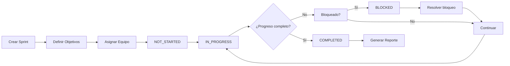
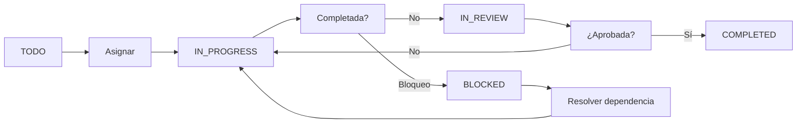

# Sprint Tracker Architecture

## Resumen

Sistema interno de seguimiento de desarrollo para gestión de sprints y tareas. Incluye asignación de desarrolladores, seguimiento de progreso, sistema de notificaciones y reportes de equipo.

## Arquitectura del Sistema

### Componentes Principales

```
Sprint Tracker System
├── Sprint Management
│   ├── Sprint CRUD Operations
│   ├── Sprint Status Tracking
│   ├── Sprint Progress Calculation
│   └── Sprint Objectives Management
├── Task Management
│   ├── Task CRUD Operations
│   ├── Task Status Workflow
│   ├── Task Priority System
│   ├── Task Dependencies
│   └── Task Assignment
├── Progress Tracking
│   ├── Real-time Progress Calculation
│   ├── Sprint Progress Analytics
│   ├── Task Completion Tracking
│   └── Progress Visualization
├── Notification System
│   ├── Task Assignment Notifications
│   ├── Task Status Change Alerts
│   ├── Sprint Milestone Notifications
│   └── Notification Prioritization
└── Team Management
    ├── Team Member Registry
    ├── Availability Tracking
    ├── Workload Balancing
    └── Performance Metrics
```

---

## Sprint Management

### Modelo de Sprint

```typescript
interface Sprint {
  id: string;
  name: string;
  description?: string;
  type: SprintType;
  status: SprintStatus;
  startDate: Date;
  endDate: Date;
  tenantId: string;
  projectId?: string;
  objectives?: string[];
  teamMembers?: string[];
  notes?: string;
  createdBy: string;
  createdAt: Date;
  updatedAt: Date;
  progress: number;
  totalTasks: number;
  completedTasks: number;
}

enum SprintType {
  DEVELOPMENT = 'DEVELOPMENT',
  REFACTORING = 'REFACTORING',
  DOCUMENTATION = 'DOCUMENTATION',
  TESTING = 'TESTING',
  INFRASTRUCTURE = 'INFRASTRUCTURE',
}

enum SprintStatus {
  NOT_STARTED = 'NOT_STARTED',
  IN_PROGRESS = 'IN_PROGRESS',
  BLOCKED = 'BLOCKED',
  COMPLETED = 'COMPLETED',
  CANCELLED = 'CANCELLED',
}
```

### Flujo de Gestión de Sprints



### Operaciones de Sprint

```typescript
class SprintService {
  // Crear nuevo sprint
  async createSprint(dto: CreateSprintDto, userId: string): Promise<SprintDto> {
    const sprint = this.sprintRepository.create({
      id: uuidv4(),
      name: dto.name,
      description: dto.description,
      type: dto.type,
      status: SprintStatus.NOT_STARTED,
      startDate: new Date(dto.startDate),
      endDate: new Date(dto.endDate),
      tenantId: dto.tenantId,
      projectId: dto.projectId,
      objectives: dto.objectives || [],
      teamMembers: [],
      createdBy: userId,
      createdAt: new Date(),
      updatedAt: new Date(),
      progress: 0,
      totalTasks: 0,
      completedTasks: 0,
    });

    await this.sprintRepository.save(sprint);

    // Notificar al equipo
    await this.notifySprintCreation(sprint.id, userId, dto.tenantId);

    return this.mapSprintToDto(sprint);
  }

  // Actualizar sprint
  async updateSprint(sprintId: string, dto: UpdateSprintDto, userId: string): Promise<SprintDto> {
    const sprint = await this.sprintRepository.findOne({
      where: { id: sprintId },
    });

    // Actualizar campos
    if (dto.name !== undefined) sprint.name = dto.name;
    if (dto.description !== undefined) sprint.description = dto.description;
    if (dto.endDate !== undefined) sprint.endDate = new Date(dto.endDate);

    // Actualizar estado con auto-notificaciones
    if (dto.status !== undefined) {
      sprint.status = dto.status;

      if (dto.status === SprintStatus.COMPLETED) {
        sprint.progress = 100;
        await this.notifySprintCompletion(sprint.id, userId);
      } else if (dto.status === SprintStatus.IN_PROGRESS) {
        await this.notifySprintStart(sprint.id, userId);
      } else if (dto.status === SprintStatus.BLOCKED) {
        await this.notifySprintBlocked(sprint.id, userId);
      }
    }

    if (dto.notes !== undefined) sprint.notes = dto.notes;

    sprint.updatedAt = new Date();
    await this.sprintRepository.save(sprint);

    return this.mapSprintToDto(sprint);
  }

  // Eliminar sprint
  async deleteSprint(sprintId: string, tenantId: string): Promise<void> {
    // Eliminar tareas asociadas
    await this.taskRepository.delete({ sprintId });

    // Eliminar sprint
    await this.sprintRepository.delete({ id: sprintId, tenantId });
  }
}
```

---

## Task Management

### Modelo de Tarea

```typescript
interface Task {
  id: string;
  title: string;
  description: string;
  sprintId: string;
  status: TaskStatus;
  priority: TaskPriority;
  dueDate?: Date;
  tags?: string[];
  estimatedHours?: number;
  assignedTo?: string;
  assignedToName?: string;
  dependsOn?: string[];
  blockedBy?: string[];
  notes?: string;
  tenantId: string;
  createdBy: string;
  createdAt: Date;
  updatedAt: Date;
  sprintName?: string;
}

enum TaskStatus {
  TODO = 'TODO',
  IN_PROGRESS = 'IN_PROGRESS',
  IN_REVIEW = 'IN_REVIEW',
  COMPLETED = 'COMPLETED',
  CANCELLED = 'CANCELLED',
  BLOCKED = 'BLOCKED',
}

enum TaskPriority {
  CRITICAL = 'CRITICAL',
  HIGH = 'HIGH',
  MEDIUM = 'MEDIUM',
  LOW = 'LOW',
}
```

### Workflow de Tareas



### Sistema de Dependencias

```typescript
class TaskDependencyManager {
  // Validar dependencias antes de iniciar tarea
  async validateDependencies(taskId: string): Promise<boolean> {
    const task = await this.taskRepository.findOne({
      where: { id: taskId },
    });

    if (!task.dependsOn || task.dependsOn.length === 0) {
      return true; // No tiene dependencias
    }

    // Verificar que todas las dependencias estén completadas
    const dependencies = await this.taskRepository.findByIds(task.dependsOn);
    const allCompleted = dependencies.every(dep => dep.status === TaskStatus.COMPLETED);

    if (!allCompleted) {
      // Bloquear tarea si hay dependencias pendientes
      task.status = TaskStatus.BLOCKED;
      task.blockedBy = dependencies
        .filter(dep => dep.status !== TaskStatus.COMPLETED)
        .map(dep => dep.title);

      await this.taskRepository.save(task);
      return false;
    }

    return true;
  }

  // Calcular tareas bloqueadas por tarea actual
  async getBlockingTasks(taskId: string): Promise<string[]> {
    const tasks = await this.taskRepository.find({
      where: { dependsOn: ArrayContaining([taskId]) },
    });

    return tasks.filter(t => t.status === TaskStatus.BLOCKED).map(t => t.id);
  }
}
```

### Gestión de Prioridades

```typescript
class TaskPriorityManager {
  // Calcular score de prioridad
  calculatePriorityScore(task: Task): number {
    let score = 0;

    // Base priority
    const priorityScores = {
      CRITICAL: 100,
      HIGH: 75,
      MEDIUM: 50,
      LOW: 25,
    };
    score += priorityScores[task.priority];

    // Due date urgency
    if (task.dueDate) {
      const daysUntilDue = Math.floor(
        (new Date(task.dueDate).getTime() - Date.now()) / (1000 * 60 * 60 * 24)
      );

      if (daysUntilDue <= 1) score += 50;
      else if (daysUntilDue <= 3) score += 30;
      else if (daysUntilDue <= 7) score += 15;
    }

    // Estimation complexity
    if (task.estimatedHours) {
      score += Math.min(task.estimatedHours / 2, 20);
    }

    // Blocked tasks have lower priority (to focus on unblocking)
    if (task.status === TaskStatus.BLOCKED) {
      score -= 30;
    }

    return score;
  }

  // Ordenar tareas por prioridad
  sortTasksByPriority(tasks: Task[]): Task[] {
    return tasks.sort((a, b) =>
      this.calculatePriorityScore(b) - this.calculatePriorityScore(a)
    );
  }
}
```

---

## Progress Tracking

### Cálculo de Progreso

```typescript
interface SprintProgress {
  sprintId: string;
  sprintName: string;
  progress: number;
  totalTasks: number;
  completedTasks: number;
  inProgressTasks: number;
  blockedTasks: number;
  remainingTasks: number;
  completedPercentage: number;
  onTrack: boolean;
  atRisk: boolean;
  estimatedCompletionDate?: Date;
}

class ProgressTracker {
  // Calcular progreso de sprint
  async getSprintProgress(sprintId: string, tenantId: string): Promise<SprintProgress> {
    const sprint = await this.sprintRepository.findOne({
      where: { id: sprintId, tenantId },
    });

    const tasks = await this.taskRepository.find({
      where: { sprintId },
    });

    const totalTasks = tasks.length;
    const completedTasks = tasks.filter(t => t.status === TaskStatus.COMPLETED).length;
    const inProgressTasks = tasks.filter(t => t.status === TaskStatus.IN_PROGRESS).length;
    const blockedTasks = tasks.filter(t => t.status === TaskStatus.BLOCKED).length;
    const remainingTasks = totalTasks - completedTasks;

    const progress = totalTasks > 0 ? (completedTasks / totalTasks) * 100 : 0;
    const completedPercentage = Math.round(progress);

    // Calcular si está en línea
    const daysPassed = Math.floor(
      (Date.now() - new Date(sprint.startDate).getTime()) / (1000 * 60 * 60 * 24)
    );
    const totalDays = Math.floor(
      (new Date(sprint.endDate).getTime() - new Date(sprint.startDate).getTime()) / (1000 * 60 * 60 * 24)
    );
    const expectedProgress = daysPassed / totalDays;
    const onTrack = progress >= expectedProgress - 10;
    const atRisk = !onTrack && progress < expectedProgress - 20;

    // Estimar fecha de completación
    let estimatedCompletionDate: Date | undefined;
    if (inProgressTasks > 0) {
      const avgDaysPerTask = daysPassed / (completedTasks + inProgressTasks);
      const remainingDays = remainingTasks * avgDaysPerTask;
      estimatedCompletionDate = new Date(Date.now() + remainingDays * 24 * 60 * 60 * 1000);
    }

    return {
      sprintId,
      sprintName: sprint.name,
      progress,
      totalTasks,
      completedTasks,
      inProgressTasks,
      blockedTasks,
      remainingTasks,
      completedPercentage,
      onTrack,
      atRisk,
      estimatedCompletionDate,
    };
  }

  // Actualizar progreso de sprint automáticamente
  async updateSprintProgress(sprintId: string): Promise<void> {
    const tasks = await this.taskRepository.find({
      where: { sprintId },
    });

    const totalTasks = tasks.length;
    const completedTasks = tasks.filter(t => t.status === TaskStatus.COMPLETED).length;
    const progress = totalTasks > 0 ? (completedTasks / totalTasks) * 100 : 0;

    await this.sprintRepository.update(
      { id: sprintId },
      {
        progress,
        completedTasks,
        updatedAt: new Date(),
      },
    );

    // Auto-actualizar estado basado en progreso
    if (progress === 100 && totalTasks > 0) {
      await this.sprintRepository.update(
        { id: sprintId },
        { status: SprintStatus.COMPLETED },
      );
    } else if (progress > 0 && progress < 100) {
      await this.sprintRepository.update(
        { id: sprintId },
        { status: SprintStatus.IN_PROGRESS },
      );
    }
  }
}
```

---

## Notification System

### Tipos de Notificaciones

```typescript
interface Notification {
  id: string;
  type: NotificationType;
  title: string;
  message: string;
  taskId?: string;
  sprintId?: string;
  recipientId: string;
  read: boolean;
  createdAt: Date;
  priority: NotificationPriority;
  metadata?: Record<string, any>;
}

type NotificationType =
  | 'TASK_ASSIGNED'
  | 'TASK_COMPLETED'
  | 'TASK_IN_PROGRESS'
  | 'TASK_BLOCKED'
  | 'SPRINT_CREATED'
  | 'SPRINT_STARTED'
  | 'SPRINT_COMPLETED'
  | 'SPRINT_BLOCKED';

type NotificationPriority = 'LOW' | 'MEDIUM' | 'HIGH' | 'URGENT';
```

### Sistema de Notificaciones

```typescript
class NotificationService {
  // Crear notificación
  async createNotification(
    type: string,
    title: string,
    message: string,
    recipientId: string,
    taskId?: string,
    sprintId?: string,
    priority: NotificationPriority = 'MEDIUM',
    metadata?: Record<string, any>,
  ): Promise<void> {
    const notification = this.notificationRepository.create({
      id: uuidv4(),
      type,
      title,
      message,
      taskId,
      sprintId,
      recipientId,
      read: false,
      createdAt: new Date(),
      priority,
      metadata,
    });

    await this.notificationRepository.save(notification);
  }

  // Notificar asignación de tarea
  async notifyTaskAssignment(taskId: string, assignedTo: string, createdBy: string): Promise<void> {
    const task = await this.taskRepository.findOne({
      where: { id: taskId },
    });

    await this.createNotification(
      'TASK_ASSIGNED',
      'Nueva tarea asignada',
      `Has sido asignado a la tarea: ${task.title}`,
      assignedTo,
      taskId,
      task.sprintId,
      'HIGH',
      { assignedBy: createdBy },
    );
  }

  // Notificar completación de tarea
  async notifyTaskCompletion(taskId: string, completedBy: string): Promise<void> {
    const task = await this.taskRepository.findOne({
      where: { id: taskId },
    });

    await this.createNotification(
      'TASK_COMPLETED',
      'Tarea completada',
      `La tarea "${task.title}" ha sido completada`,
      completedBy,
      taskId,
      task.sprintId,
      'MEDIUM',
      { completedBy },
    );
  }

  // Notificar sprint bloqueado
  async notifySprintBlocked(sprintId: string, userId: string): Promise<void> {
    const sprint = await this.sprintRepository.findOne({
      where: { id: sprintId },
    });

    await this.createNotification(
      'SPRINT_BLOCKED',
      'Sprint bloqueado',
      `El sprint "${sprint.name}" está bloqueado`,
      userId,
      undefined,
      sprintId,
      'URGENT',
    );
  }
}
```

### Priorización de Notificaciones

```typescript
class NotificationPrioritizer {
  // Ordenar notificaciones por prioridad y fecha
  prioritizeNotifications(notifications: Notification[]): Notification[] {
    const priorityOrder = { URGENT: 0, HIGH: 1, MEDIUM: 2, LOW: 3 };

    return notifications.sort((a, b) => {
      // Primero por prioridad
      const priorityDiff = priorityOrder[a.priority] - priorityOrder[b.priority];
      if (priorityDiff !== 0) return priorityDiff;

      // Luego por estado de lectura (no leídas primero)
      if (!a.read && b.read) return -1;
      if (a.read && !b.read) return 1;

      // Finalmente por fecha (más recientes primero)
      return new Date(b.createdAt).getTime() - new Date(a.createdAt).getTime();
    });
  }

  // Calcular badge count
  calculateUnreadCount(notifications: Notification[]): number {
    return notifications.filter(n => !n.read).length;
  }
}
```

---

## Team Management

### Modelo de Miembro de Equipo

```typescript
interface TeamMember {
  id: string;
  name: string;
  role: string;
  email: string;
  avatar?: string;
  isActive: boolean;
  availableHours: number;
  assignedTasks: number;
  completedTasks: number;
  tenantId: string;
  createdAt: Date;
}
```

### Gestión de Carga de Trabajo

```typescript
class WorkloadManager {
  // Calcular carga de trabajo actual
  async calculateWorkload(memberId: string): Promise<{
    assignedTasks: number;
    totalEstimatedHours: number;
    completedTasks: number;
    completionRate: number;
    workloadPercentage: number;
  }> {
    const tasks = await this.taskRepository.find({
      where: { assignedTo: memberId },
    });

    const assignedTasks = tasks.length;
    const totalEstimatedHours = tasks.reduce((sum, t) => sum + (t.estimatedHours || 0), 0);
    const completedTasks = tasks.filter(t => t.status === TaskStatus.COMPLETED).length;
    const completionRate = assignedTasks > 0 ? (completedTasks / assignedTasks) * 100 : 0;

    const member = await this.teamMemberRepository.findOne({
      where: { id: memberId },
    });

    const workloadPercentage = member.availableHours > 0
      ? (totalEstimatedHours / member.availableHours) * 100
      : 0;

    return {
      assignedTasks,
      totalEstimatedHours,
      completedTasks,
      completionRate,
      workloadPercentage,
    };
  }

  // Balancear carga de trabajo
  async balanceWorkload(sprintId: string): Promise<void> {
    const tasks = await this.taskRepository.find({
      where: { sprintId, status: TaskStatus.TODO },
    });

    const members = await this.teamMemberRepository.find({
      where: { isActive: true },
    });

    // Calcular carga actual de cada miembro
    const workloads = await Promise.all(
      members.map(async member => ({
        member,
        workload: await this.calculateWorkload(member.id),
      })),
    );

    // Asignar tareas al miembro con menor carga
    for (const task of tasks) {
      const availableMember = workloads
        .filter(w => w.workload.workloadPercentage < 80)
        .sort((a, b) => a.workload.workloadPercentage - b.workload.workloadPercentage)[0];

      if (availableMember) {
        task.assignedTo = availableMember.member.id;
        await this.taskRepository.save(task);
      }
    }
  }
}
```

---

## API Reference

### Sprints

```http
POST /api/v1/sprint-tracker/sprints
Authorization: Bearer {token}

{
  "name": "Sprint 16: Roadmap/Sprint Tracker",
  "description": "Sistema de seguimiento de desarrollo",
  "type": "DEVELOPMENT",
  "startDate": "2026-05-31",
  "endDate": "2026-06-07",
  "tenantId": "uuid-tenant-id",
  "objectives": ["Modelo de sprints", "Gestión de tareas", "Notificaciones"]
}

Response 201:
{
  "id": "uuid",
  "name": "Sprint 16: Roadmap/Sprint Tracker",
  "description": "...",
  "type": "DEVELOPMENT",
  "status": "NOT_STARTED",
  "startDate": "2026-05-31T00:00:00Z",
  "endDate": "2026-06-07T00:00:00Z",
  "tenantId": "uuid-tenant-id",
  "createdBy": "uuid-user-id",
  "createdAt": "2026-05-31T00:00:00Z",
  "updatedAt": "2026-05-31T00:00:00Z",
  "progress": 0,
  "totalTasks": 0,
  "completedTasks": 0
}
```

```http
PUT /api/v1/sprint-tracker/sprints/:id
Authorization: Bearer {token}

{
  "status": "IN_PROGRESS",
  "notes": "Sprint iniciado según plan"
}

Response 200:
{
  "id": "uuid",
  "name": "Sprint 16: Roadmap/Sprint Tracker",
  "status": "IN_PROGRESS",
  "progress": 0,
  ...
}
```

### Tasks

```http
POST /api/v1/sprint-tracker/tasks
Authorization: Bearer {token}

{
  "title": "Crear DTOs de Sprint Tracker",
  "description": "Definir enums y DTOs para sprints y tareas",
  "sprintId": "uuid-sprint-id",
  "priority": "HIGH",
  "estimatedHours": 4,
  "assignedTo": "uuid-user-id",
  "tenantId": "uuid-tenant-id",
  "tags": ["backend", "dto"]
}

Response 201:
{
  "id": "uuid-task-id",
  "title": "Crear DTOs de Sprint Tracker",
  "description": "...",
  "sprintId": "uuid-sprint-id",
  "status": "TODO",
  "priority": "HIGH",
  "estimatedHours": 4,
  "assignedTo": "uuid-user-id",
  "assignedToName": "Developer Name",
  "tenantId": "uuid-tenant-id",
  "createdBy": "uuid-user-id",
  "createdAt": "2026-05-31T00:00:00Z",
  "updatedAt": "2026-05-31T00:00:00Z",
  "tags": ["backend", "dto"]
}
```

### Progress

```http
GET /api/v1/sprint-tracker/sprints/:sprintId/progress
Authorization: Bearer {token}

Response 200:
{
  "sprintId": "uuid-sprint-id",
  "sprintName": "Sprint 16: Roadmap/Sprint Tracker",
  "progress": 45.0,
  "totalTasks": 8,
  "completedTasks": 4,
  "inProgressTasks": 2,
  "blockedTasks": 0,
  "remainingTasks": 4,
  "completedPercentage": 45,
  "onTrack": true,
  "atRisk": false,
  "estimatedCompletionDate": "2026-06-05T00:00:00Z"
}
```

---

## Checklist de Implementación

### Sprints ✅
- [x] Modelo de sprint completo
- [x] Estados de sprint (5 tipos)
- [x] Tipos de sprint (5 tipos)
- [x] Objetivos de sprint
- [x] Auto-notificaciones de estado
- [x] Actualización automática de progreso

### Tareas ✅
- [x] Modelo de tarea completo
- [x] Estados de tarea (6 tipos)
- [x] Prioridades de tarea (4 niveles)
- [x] Sistema de dependencias
- [x] Validación de dependencias
- [x] Cálculo de prioridad

### Progreso ✅
- [x] Cálculo de progreso en tiempo real
- [x] Desglose por estado
- [x] Detección de riesgo
- [x] Estimación de fecha de completación
- [x] Auto-actualización de sprint

### Notificaciones ✅
- [x] 8 tipos de notificaciones
- [x] 4 niveles de prioridad
- [x] Sistema de priorización
- [x] Badge count de no leídas
- [x] Marcar como leída

### Equipo ✅
- [x] Registro de miembros
- [x] Seguimiento de disponibilidad
- [x] Cálculo de carga de trabajo
- [x] Balanceo automático
- [x] Métricas de desempeño

---

**Versión:** 1.0.0
**Última actualización:** 2026-05-31
**Estado:** ✅ Implementado
**Sprint:** 16 - Roadmap/Sprint Tracker Interno