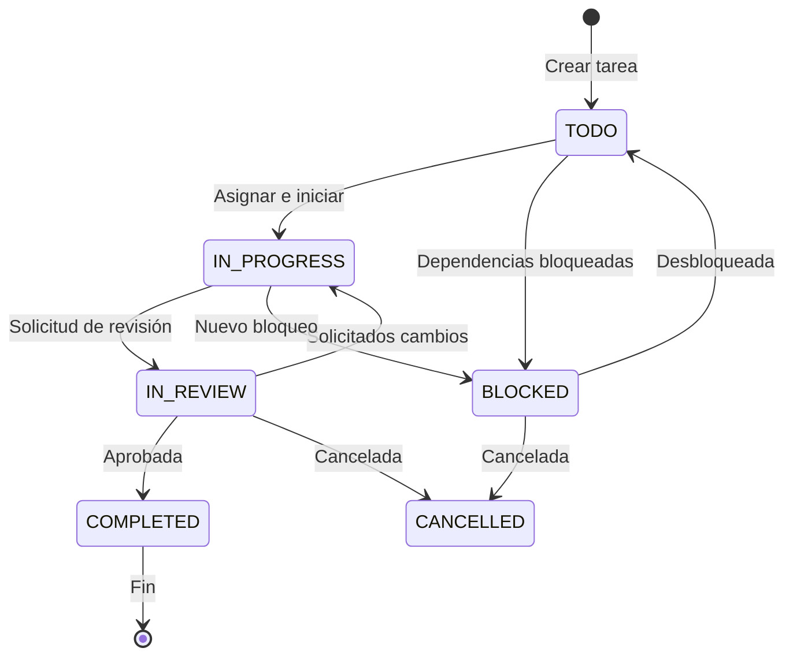

# Task Management System

## Resumen

Sistema completo de gestión de tareas con workflow de estados, prioridades, dependencias, asignación a desarrolladores y seguimiento de estimaciones.

## Workflow de Tareas

### Estados del Workflow



### Definición de Estados

```typescript
enum TaskStatus {
  TODO = 'TODO',           // Tarea pendiente de inicio
  IN_PROGRESS = 'IN_PROGRESS',  // Tarea en desarrollo activo
  IN_REVIEW = 'IN_REVIEW',     // Tarea en revisión por QA/Lead
  COMPLETED = 'COMPLETED',     // Tarea completada y aprobada
  CANCELLED = 'CANCELLED',     // Tarea cancelada
  BLOCKED = 'BLOCKED',         // Tarea bloqueada por dependencia
}
```

### Reglas de Transición de Estados

```typescript
class TaskWorkflowValidator {
  private transitions: Record<TaskStatus, TaskStatus[]> = {
    [TaskStatus.TODO]: [TaskStatus.IN_PROGRESS, TaskStatus.BLOCKED, TaskStatus.CANCELLED],
    [TaskStatus.IN_PROGRESS]: [TaskStatus.TODO, TaskStatus.IN_REVIEW, TaskStatus.BLOCKED, TaskStatus.CANCELLED],
    [TaskStatus.IN_REVIEW]: [TaskStatus.IN_PROGRESS, TaskStatus.COMPLETED, TaskStatus.CANCELLED],
    [TaskStatus.COMPLETED]: [], // Estado terminal
    [TaskStatus.CANCELLED]: [], // Estado terminal
    [TaskStatus.BLOCKED]: [TaskStatus.TODO, TaskStatus.IN_PROGRESS, TaskStatus.CANCELLED],
  };

  canTransition(from: TaskStatus, to: TaskStatus): boolean {
    return this.transitions[from].includes(to);
  }

  validateTransition(from: TaskStatus, to: TaskStatus, task: Task): {
    valid: boolean;
    reason?: string;
  } {
    // Validar transición base
    if (!this.canTransition(from, to)) {
      return {
        valid: false,
        reason: `Transición no válida de ${from} a ${to}`,
      };
    }

    // Reglas específicas
    switch (to) {
      case TaskStatus.IN_PROGRESS:
        // Verificar dependencias completadas
        if (task.dependsOn && task.dependsOn.length > 0) {
          const dependenciesCompleted = await this.checkDependencies(task.dependsOn);
          if (!dependenciesCompleted) {
            return {
              valid: false,
              reason: 'Tiene dependencias pendientes',
            };
          }
        }
        break;

      case TaskStatus.IN_REVIEW:
        // Verificar que la tarea tiene asignado
        if (!task.assignedTo) {
          return {
            valid: false,
            reason: 'La tarea debe tener un asignado para solicitar revisión',
          };
        }
        break;

      case TaskStatus.COMPLETED:
        // Verificar que todas las subtareas estén completadas
        // (si se implementa subtareas en el futuro)
        break;
    }

    return { valid: true };
  }
}
```

---

## Sistema de Prioridades

### Niveles de Prioridad

```typescript
enum TaskPriority {
  CRITICAL = 'CRITICAL',  // Crítica - Bloquea release crítico
  HIGH = 'HIGH',          // Alta - Importante para sprint
  MEDIUM = 'MEDIUM',      // Media - Tarea normal
  LOW = 'LOW',            // Baja - Mejora o nice-to-have
}
```

### Algoritmo de Scoring de Prioridad

```typescript
class PriorityScoringSystem {
  calculatePriorityScore(task: Task): {
    score: number;
    category: 'URGENT' | 'HIGH' | 'NORMAL' | 'LOW';
  } {
    let score = 0;

    // 1. Prioridad base (0-100)
    const basePriorityScores = {
      CRITICAL: 100,
      HIGH: 75,
      MEDIUM: 50,
      LOW: 25,
    };
    score += basePriorityScores[task.priority];

    // 2. Urgencia por fecha límite (0-50)
    if (task.dueDate) {
      const daysUntilDue = Math.floor(
        (new Date(task.dueDate).getTime() - Date.now()) / (1000 * 60 * 60 * 24)
      );

      if (daysUntilDue <= 1) score += 50;       // Mañana o hoy
      else if (daysUntilDue <= 3) score += 40;  // 2-3 días
      else if (daysUntilDue <= 7) score += 30;  // 1 semana
      else if (daysUntilDue <= 14) score += 20; // 2 semanas
      else if (daysUntilDue <= 30) score += 10; // 1 mes
    }

    // 3. Complejidad estimada (0-20)
    if (task.estimatedHours) {
      score += Math.min(task.estimatedHours / 2, 20);
    }

    // 4. Estado actual (0-30)
    const statusScores = {
      [TaskStatus.BLOCKED]: -30,  // Penalizar tareas bloqueadas
      [TaskStatus.IN_PROGRESS]: 20,  // En progreso mantiene prioridad
      [TaskStatus.IN_REVIEW]: 15,   // En revisión mantiene prioridad
      [TaskStatus.TODO]: 0,
      [TaskStatus.COMPLETED]: 0,
      [TaskStatus.CANCELLED]: 0,
    };
    score += statusScores[task.status];

    // 5. Dependencias (0-25)
    if (task.dependsOn && task.dependsOn.length > 0) {
      const completedDeps = await this.getCompletedDependencies(task.dependsOn);
      const depRatio = completedDeps / task.dependsOn.length;
      score += depRatio * 25;  // Más puntos mientras más dependencias completadas
    }

    // Normalizar score (0-200)
    score = Math.max(0, Math.min(200, score));

    // Categorizar
    let category: 'URGENT' | 'HIGH' | 'NORMAL' | 'LOW';
    if (score >= 150) category = 'URGENT';
    else if (score >= 100) category = 'HIGH';
    else if (score >= 50) category = 'NORMAL';
    else category = 'LOW';

    return { score, category };
  }

  sortTasksByPriority(tasks: Task[]): Task[] {
    return tasks.sort((a, b) => {
      const scoreA = this.calculatePriorityScore(a).score;
      const scoreB = this.calculatePriorityScore(b).score;
      return scoreB - scoreA;
    });
  }
}
```

### Reglas de Prioridad Automática

```typescript
class AutoPriorityManager {
  // Auto-ajustar prioridad basado en dependencias críticas
  async autoAdjustPriority(taskId: string): Promise<void> {
    const task = await this.taskRepository.findOne({
      where: { id: taskId },
    });

    if (!task.dependsOn || task.dependsOn.length === 0) return;

    // Verificar si alguna dependencia está bloqueada
    const dependencies = await this.taskRepository.findByIds(task.dependsOn);
    const hasBlockedDependency = dependencies.some(d => d.status === TaskStatus.BLOCKED);

    // Si la tarea está bloqueando a otras tareas críticas
    const blockingTasks = await this.getBlockingTasks(taskId);
    const hasCriticalBlocking = blockingTasks.some(t => t.priority === TaskPriority.CRITICAL);

    if (hasCriticalBlocking && task.priority !== TaskPriority.CRITICAL) {
      task.priority = TaskPriority.CRITICAL;
      await this.taskRepository.save(task);

      // Notificar cambio de prioridad
      await this.notifyPriorityChange(task.id, 'CRITICAL');
    }
  }

  // Detectar tareas atascadas (mismo estado por mucho tiempo)
  async detectStuckTasks(sprintId: string): Promise<Task[]> {
    const tasks = await this.taskRepository.find({
      where: { sprintId },
    });

    const stuckTasks: Task[] = [];
    const stuckThreshold = 7 * 24 * 60 * 60 * 1000; // 7 días en ms

    for (const task of tasks) {
      if (
        task.status === TaskStatus.IN_PROGRESS ||
        task.status === TaskStatus.IN_REVIEW ||
        task.status === TaskStatus.BLOCKED
      ) {
        const timeInStatus = Date.now() - new Date(task.updatedAt).getTime();

        if (timeInStatus > stuckThreshold) {
          stuckTasks.push(task);
        }
      }
    }

    return stuckTasks;
  }
}
```

---

## Sistema de Dependencias

### Grafo de Dependencias

```typescript
class DependencyGraph {
  private graph: Map<string, Set<string>> = new Map();

  // Agregar dependencia: B depende de A
  addDependency(taskId: string, dependsOn: string): void {
    if (!this.graph.has(taskId)) {
      this.graph.set(taskId, new Set());
    }
    this.graph.get(taskId)!.add(dependsOn);
  }

  // Eliminar dependencia
  removeDependency(taskId: string, dependsOn: string): void {
    this.graph.get(taskId)?.delete(dependsOn);
  }

  // Verificar ciclo (prevenir dependencias circulares)
  hasCycle(): boolean {
    const visited = new Set<string>();
    const recursionStack = new Set<string>();

    for (const [taskId] of this.graph) {
      if (this.dfsHasCycle(taskId, visited, recursionStack)) {
        return true;
      }
    }

    return false;
  }

  private dfsHasCycle(
    taskId: string,
    visited: Set<string>,
    recursionStack: Set<string>,
  ): boolean {
    if (recursionStack.has(taskId)) {
      return true;
    }

    if (visited.has(taskId)) {
      return false;
    }

    visited.add(taskId);
    recursionStack.add(taskId);

    const dependencies = this.graph.get(taskId) || new Set();
    for (const depId of dependencies) {
      if (this.dfsHasCycle(depId, visited, recursionStack)) {
        return true;
      }
    }

    recursionStack.delete(taskId);
    return false;
  }

  // Obtener orden topológico (orden de ejecución)
  getTopologicalOrder(): string[] {
    const inDegree = new Map<string, number>();
    const allTasks = new Set<string>();

    // Calcular in-degree
    for (const [taskId, deps] of this.graph) {
      allTasks.add(taskId);
      inDegree.set(taskId, inDegree.get(taskId) || 0);

      for (const depId of deps) {
        allTasks.add(depId);
        inDegree.set(depId, (inDegree.get(depId) || 0) + 1);
      }
    }

    // BFS para orden topológico
    const queue: string[] = [];
    for (const taskId of allTasks) {
      if (inDegree.get(taskId) === 0) {
        queue.push(taskId);
      }
    }

    const order: string[] = [];
    while (queue.length > 0) {
      const taskId = queue.shift()!;
      order.push(taskId);

      const dependencies = this.graph.get(taskId) || new Set();
      for (const depId of dependencies) {
        inDegree.set(depId, inDegree.get(depId)! - 1);
        if (inDegree.get(depId) === 0) {
          queue.push(depId);
        }
      }
    }

    return order;
  }

  // Obtener tareas que bloquean a esta tarea
  getBlockingTasks(taskId: string): string[] {
    const blocking: string[] = [];

    for (const [id, deps] of this.graph) {
      if (deps.has(taskId)) {
        blocking.push(id);
      }
    }

    return blocking;
  }

  // Obtener tareas que esta tarea está bloqueando
  getBlockedBy(taskId: string): string[] {
    return Array.from(this.graph.get(taskId) || []);
  }
}
```

### Validación de Dependencias

```typescript
class DependencyValidator {
  // Validar antes de agregar dependencia
  async validateDependencyAdd(taskId: string, dependsOnId: string): Promise<{
    valid: boolean;
    reason?: string;
  }> {
    // Verificar que no sea auto-dependencia
    if (taskId === dependsOnId) {
      return {
        valid: false,
        reason: 'Una tarea no puede depender de sí misma',
      };
    }

    // Verificar que ambas tareas existen
    const [task, dependsOnTask] = await Promise.all([
      this.taskRepository.findOne({ where: { id: taskId } }),
      this.taskRepository.findOne({ where: { id: dependsOnId } }),
    ]);

    if (!task || !dependsOnTask) {
      return {
        valid: false,
        reason: 'Una o ambas tareas no existen',
      };
    }

    // Verificar que estén en el mismo sprint
    if (task.sprintId !== dependsOnTask.sprintId) {
      return {
        valid: false,
        reason: 'Las tareas deben estar en el mismo sprint',
      };
    }

    // Verificar que no cree ciclo
    const graph = await this.buildDependencyGraph(task.sprintId);
    graph.addDependency(taskId, dependsOnId);

    if (graph.hasCycle()) {
      return {
        valid: false,
        reason: 'Esta dependencia crearía un ciclo circular',
      };
    }

    // Verificar que la tarea de dependencia no esté completada
    if (dependsOnTask.status === TaskStatus.COMPLETED) {
      return {
        valid: false,
        reason: 'La tarea dependiente ya está completada',
      };
    }

    return { valid: true };
  }

  // Verificar dependencias antes de iniciar tarea
  async validateTaskStart(taskId: string): Promise<{
    valid: boolean;
    blockedBy?: string[];
  }> {
    const task = await this.taskRepository.findOne({
      where: { id: taskId },
    });

    if (!task.dependsOn || task.dependsOn.length === 0) {
      return { valid: true };
    }

    const dependencies = await this.taskRepository.findByIds(task.dependsOn);
    const incompleteDeps = dependencies.filter(d => d.status !== TaskStatus.COMPLETED);

    if (incompleteDeps.length > 0) {
      return {
        valid: false,
        blockedBy: incompleteDeps.map(d => d.title),
      };
    }

    return { valid: true };
  }

  // Auto-bloquear tareas con dependencias pendientes
  async autoBlockPendingDependencies(sprintId: string): Promise<void> {
    const tasks = await this.taskRepository.find({
      where: { sprintId },
    });

    for (const task of tasks) {
      if (task.dependsOn && task.dependsOn.length > 0) {
        const dependencies = await this.taskRepository.findByIds(task.dependsOn);
        const hasIncompleteDep = dependencies.some(d => d.status !== TaskStatus.COMPLETED);

        if (hasIncompleteDep && task.status === TaskStatus.TODO) {
          task.status = TaskStatus.BLOCKED;
          task.blockedBy = dependencies
            .filter(d => d.status !== TaskStatus.COMPLETED)
            .map(d => d.title);

          await this.taskRepository.save(task);
        }
      }
    }
  }
}
```

---

## Asignación de Tareas

### Sistema de Asignación

```typescript
class TaskAssignmentManager {
  // Asignar tarea a desarrollador
  async assignTask(taskId: string, userId: string, assignedBy: string): Promise<TaskDto> {
    const task = await this.taskRepository.findOne({
      where: { id: taskId },
    });

    if (!task) {
      throw new NotFoundException('Task not found');
    }

    // Verificar disponibilidad del desarrollador
    const workload = await this.calculateWorkload(userId);
    const maxHoursPerSprint = 40; // Máximo 40 horas por sprint

    if (workload.totalEstimatedHours + (task.estimatedHours || 0) > maxHoursPerSprint) {
      throw new ConflictException('Desarrollador no tiene disponibilidad suficiente');
    }

    task.assignedTo = userId;
    task.updatedAt = new Date();

    await this.taskRepository.save(task);

    // Actualizar contador de tareas del desarrollador
    await this.updateTaskCount(userId);

    // Notificar asignación
    await this.notifyTaskAssignment(taskId, userId, assignedBy);

    return this.mapTaskToDto(task);
  }

  // Auto-asignar tarea al desarrollador más disponible
  async autoAssignTask(taskId: string): Promise<TaskDto> {
    const task = await this.taskRepository.findOne({
      where: { id: taskId },
    });

    // Obtener desarrolladores disponibles
    const members = await this.teamMemberRepository.find({
      where: { isActive: true },
    });

    // Calcular carga de trabajo de cada miembro
    const workloads = await Promise.all(
      members.map(async member => ({
        member,
        workload: await this.calculateWorkload(member.id),
      })),
    );

    // Seleccionar el más disponible
    const sorted = workloads.sort((a, b) =>
      a.workload.workloadPercentage - b.workload.workloadPercentage
    );

    // Seleccionar solo si tiene disponibilidad < 80%
    const availableMember = sorted.find(w => w.workload.workloadPercentage < 80);

    if (!availableMember) {
      throw new ConflictException('No hay desarrolladores disponibles');
    }

    return this.assignTask(taskId, availableMember.member.id, 'SYSTEM');
  }

  // Reasignar tarea
  async reassignTask(
    taskId: string,
    newUserId: string,
    reassignedBy: string,
  ): Promise<TaskDto> {
    const task = await this.taskRepository.findOne({
      where: { id: taskId },
    });

    const oldUserId = task.assignedTo;

    task.assignedTo = newUserId;
    task.updatedAt = new Date();

    await this.taskRepository.save(task);

    // Actualizar contadores
    if (oldUserId) await this.updateTaskCount(oldUserId);
    await this.updateTaskCount(newUserId);

    // Notificar nuevo asignado y antiguo asignado
    await this.notifyTaskReassignment(taskId, oldUserId, newUserId, reassignedBy);

    return this.mapTaskToDto(task);
  }
}
```

### Cálculo de Carga de Trabajo

```typescript
class WorkloadCalculator {
  // Calcular carga de trabajo actual
  async calculateWorkload(userId: string): Promise<{
    assignedTasks: number;
    totalEstimatedHours: number;
    completedTasks: number;
    completionRate: number;
    workloadPercentage: number;
    overdueTasks: number;
  }> {
    const tasks = await this.taskRepository.find({
      where: { assignedTo: userId },
    });

    const assignedTasks = tasks.length;
    const totalEstimatedHours = tasks.reduce((sum, t) => sum + (t.estimatedHours || 0), 0);
    const completedTasks = tasks.filter(t => t.status === TaskStatus.COMPLETED).length;
    const completionRate = assignedTasks > 0 ? (completedTasks / assignedTasks) * 100 : 0;

    // Calcular tareas overdue
    const overdueTasks = tasks.filter(
      t => t.dueDate &&
        new Date(t.dueDate) < new Date() &&
        t.status !== TaskStatus.COMPLETED
    ).length;

    // Obtener disponibilidad del miembro
    const member = await this.teamMemberRepository.findOne({
      where: { id: userId },
    });

    const workloadPercentage = member.availableHours > 0
      ? (totalEstimatedHours / member.availableHours) * 100
      : 0;

    return {
      assignedTasks,
      totalEstimatedHours,
      completedTasks,
      completionRate,
      workloadPercentage,
      overdueTasks,
    };
  }

  // Generar reporte de carga de trabajo del equipo
  async generateTeamWorkloadReport(sprintId: string): Promise<{
    teamMembers: Array<{
      userId: string;
      name: string;
      workload: ReturnType<WorkloadCalculator['calculateWorkload']>;
    }>;
    teamStats: {
      totalAssignedTasks: number;
      totalEstimatedHours: number;
      avgWorkloadPercentage: number;
      overloadedMembers: number;
    };
  }> {
    const tasks = await this.taskRepository.find({
      where: { sprintId },
    });

    const uniqueAssignees = [...new Set(tasks.map(t => t.assignedTo).filter(Boolean))];

    const teamMembers = await Promise.all(
      uniqueAssignees.map(async userId => {
        const member = await this.teamMemberRepository.findOne({
          where: { id: userId },
        });

        const workload = await this.calculateWorkload(userId);

        return {
          userId,
          name: member?.name || 'Unknown',
          workload,
        };
      }),
    );

    const totalAssignedTasks = tasks.length;
    const totalEstimatedHours = tasks.reduce((sum, t) => sum + (t.estimatedHours || 0), 0);
    const avgWorkloadPercentage = teamMembers.reduce((sum, m) => sum + m.workload.workloadPercentage, 0) / teamMembers.length;
    const overloadedMembers = teamMembers.filter(m => m.workload.workloadPercentage > 100).length;

    return {
      teamMembers,
      teamStats: {
        totalAssignedTasks,
        totalEstimatedHours,
        avgWorkloadPercentage,
        overloadedMembers,
      },
    };
  }
}
```

---

## Estimaciones y Tiempo

### Sistema de Estimación

```typescript
class EstimationManager {
  // Actualizar estimación de tarea
  async updateEstimation(
    taskId: string,
    estimatedHours: number,
    userId: string,
  ): Promise<TaskDto> {
    const task = await this.taskRepository.findOne({
      where: { id: taskId },
    });

    task.estimatedHours = estimatedHours;
    task.updatedAt = new Date();

    await this.taskRepository.save(task);

    // Recalcular progreso del sprint
    await this.updateSprintProgress(task.sprintId);

    return this.mapTaskToDto(task);
  }

  // Comparar estimación vs tiempo real
  async compareEstimationVsActual(taskId: string): Promise<{
    taskId: string;
    estimatedHours: number;
    actualHours: number;
    variance: number;
    variancePercentage: number;
    accuracy: 'UNDER' | 'ACCURATE' | 'OVER';
  }> {
    const task = await this.taskRepository.findOne({
      where: { id: taskId },
    });

    const estimatedHours = task.estimatedHours || 0;

    // Calcular tiempo real desde creación hasta completación
    const created = new Date(task.createdAt).getTime();
    const updated = new Date(task.updatedAt).getTime();
    const actualHours = (updated - created) / (1000 * 60 * 60);

    const variance = actualHours - estimatedHours;
    const variancePercentage = estimatedHours > 0 ? (variance / estimatedHours) * 100 : 0;

    let accuracy: 'UNDER' | 'ACCURATE' | 'OVER';
    if (Math.abs(variancePercentage) <= 10) {
      accuracy = 'ACCURATE';
    } else if (variance > 0) {
      accuracy = 'UNDER';  // Subestimada
    } else {
      accuracy = 'OVER';   // Sobrestimada
    }

    return {
      taskId,
      estimatedHours,
      actualHours,
      variance,
      variancePercentage,
      accuracy,
    };
  }

  // Analizar precisión de estimaciones del equipo
  async analyzeTeamEstimationAccuracy(sprintId: string): Promise<{
    totalTasks: number;
    avgVariancePercentage: number;
    accuracyDistribution: {
      ACCURATE: number;
      UNDER: number;
      OVER: number;
    };
    mostAccurateMember?: string;
    leastAccurateMember?: string;
  }> {
    const tasks = await this.taskRepository.find({
      where: { sprintId, status: TaskStatus.COMPLETED },
    });

    const comparisons = await Promise.all(
      tasks.map(t => this.compareEstimationVsActual(t.id))
    );

    const avgVariancePercentage =
      comparisons.reduce((sum, c) => sum + Math.abs(c.variancePercentage), 0) /
      comparisons.length;

    const accuracyDistribution = {
      ACCURATE: comparisons.filter(c => c.accuracy === 'ACCURATE').length,
      UNDER: comparisons.filter(c => c.accuracy === 'UNDER').length,
      OVER: comparisons.filter(c => c.accuracy === 'OVER').length,
    };

    // Calcular precisión por miembro
    const memberAccuracy = new Map<string, number[]>();
    for (const task of tasks) {
      if (task.assignedTo) {
        const comparison = comparisons.find(c => c.taskId === task.id);
        if (comparison) {
          const accuracies = memberAccuracy.get(task.assignedTo) || [];
          accuracies.push(Math.abs(comparison.variancePercentage));
          memberAccuracy.set(task.assignedTo, accuracies);
        }
      }
    }

    const avgAccuracyPerMember = new Map<string, number>();
    for (const [memberId, accuracies] of memberAccuracy.entries()) {
      const avg = accuracies.reduce((sum, a) => sum + a, 0) / accuracies.length;
      avgAccuracyPerMember.set(memberId, avg);
    }

    let mostAccurateMember: string | undefined;
    let leastAccurateMember: string | undefined;
    let minAvg = Infinity;
    let maxAvg = -Infinity;

    for (const [memberId, avg] of avgAccuracyPerMember.entries()) {
      if (avg < minAvg) {
        minAvg = avg;
        mostAccurateMember = memberId;
      }
      if (avg > maxAvg) {
        maxAvg = avg;
        leastAccurateMember = memberId;
      }
    }

    return {
      totalTasks: tasks.length,
      avgVariancePercentage,
      accuracyDistribution,
      mostAccurateMember,
      leastAccurateMember,
    };
  }
}
```

---

## API Reference

### Crear Tarea

```http
POST /api/v1/sprint-tracker/tasks
Authorization: Bearer {token}

{
  "title": "Crear DTOs de Sprint Tracker",
  "description": "Definir enums y DTOs para sprints y tareas",
  "sprintId": "uuid-sprint-id",
  "priority": "HIGH",
  "dueDate": "2026-06-05",
  "estimatedHours": 4,
  "assignedTo": "uuid-user-id",
  "tags": ["backend", "dto"],
  "dependsOn": [],
  "tenantId": "uuid-tenant-id"
}

Response 201:
{
  "id": "uuid-task-id",
  "title": "Crear DTOs de Sprint Tracker",
  "description": "...",
  "sprintId": "uuid-sprint-id",
  "status": "TODO",
  "priority": "HIGH",
  "dueDate": "2026-06-05T00:00:00Z",
  "estimatedHours": 4,
  "assignedTo": "uuid-user-id",
  "assignedToName": "Developer Name",
  "tags": ["backend", "dto"],
  "dependsOn": [],
  "tenantId": "uuid-tenant-id",
  "createdBy": "uuid-user-id",
  "createdAt": "2026-05-31T00:00:00Z",
  "updatedAt": "2026-05-31T00:00:00Z"
}
```

### Actualizar Estado de Tarea

```http
PUT /api/v1/sprint-tracker/tasks/:id
Authorization: Bearer {token}

{
  "status": "IN_PROGRESS",
  "notes": "Iniciando implementación de DTOs"
}

Response 200:
{
  "id": "uuid-task-id",
  "title": "Crear DTOs de Sprint Tracker",
  "status": "IN_PROGRESS",
  ...
}
```

### Asignar Tarea

```http
PUT /api/v1/sprint-tracker/tasks/:taskId/assign
Authorization: Bearer {token}

{
  "assignedTo": "uuid-user-id"
}

Response 200:
{
  "id": "uuid-task-id",
  "assignedTo": "uuid-user-id",
  "assignedToName": "Developer Name",
  ...
}
```

---

## Checklist de Implementación

### Workflow ✅
- [x] 6 estados de tarea
- [x] Validación de transiciones
- [x] Auto-bloqueo por dependencias
- [x] Desbloqueo automático

### Prioridades ✅
- [x] 4 niveles de prioridad
- [x] Algoritmo de scoring
- [x] Auto-ajuste de prioridad
- [x] Detección de tareas atascadas

### Dependencias ✅
- [x] Grafo de dependencias
- [x] Detección de ciclos
- [x] Orden topológico
- [x] Validación de dependencias
- [x] Auto-bloqueo de tareas dependientes

### Asignación ✅
- [x] Asignación manual
- [x] Auto-asignación
- [x] Reasignación
- [x] Cálculo de carga de trabajo
- [x] Balanceo automático
- [x] Reporte de carga de equipo

### Estimaciones ✅
- [x] Actualización de estimaciones
- [x] Comparación vs tiempo real
- [x] Análisis de precisión
- [x] Reporte de precisión del equipo

---

**Versión:** 1.0.0
**Última actualización:** 2026-05-31
**Estado:** ✅ Implementado
**Sprint:** 16 - Roadmap/Sprint Tracker Interno