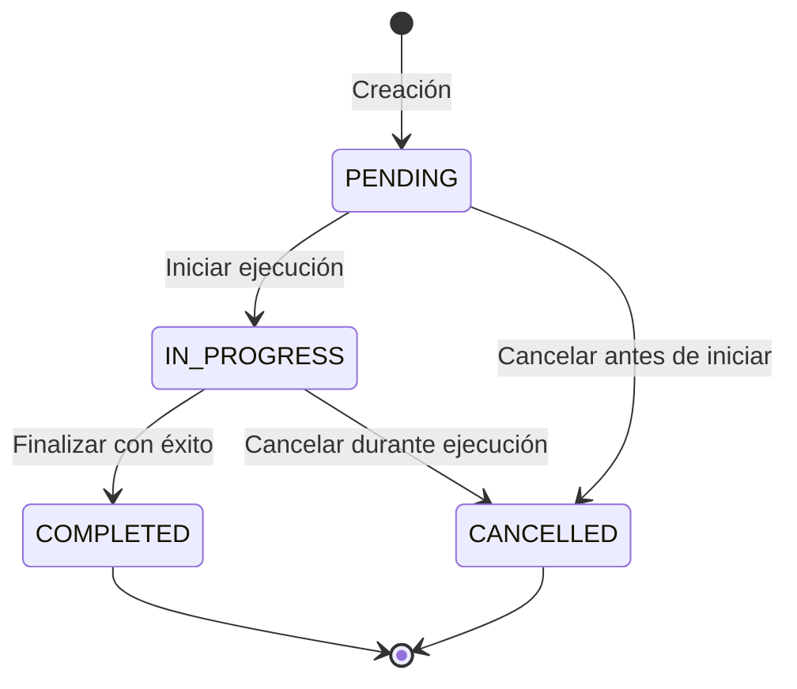

# Arquitectura de Partidas de Trabajo (Work Batches)

## Descripción General

Las Partidas de Trabajo (Work Batches) son el componente central del sistema de control de producción. Permiten organizar la producción en unidades lógicas, asignar responsabilidades, y seguimiento completo desde la planificación hasta la finalización.

## Arquitectura de Datos

### Modelo Jerárquico

```
Work Batch (Partida de Trabajo)
├── Metadata
│   ├── ID único
│   ├── Tenant ID (multi-tenancy)
│   ├── Nombre descriptivo
│   ├── Descripción opcional
│   └── Estado del ciclo de vida
├── Programación
│   ├── Fecha programada
│   ├── Hora programada
│   ├── Prioridad
│   └── Zona de cocina asignada
├── Responsables
│   ├── Lista de personal asignado
│   ├── Roles y habilidades
│   └── Disponibilidad
├── Contenido
│   ├── Órdenes de producción
│   ├── Ingredientes necesarios
│   ├── Tiempos estimados
│   └── Recursos requeridos
├── Ejecución
│   ├── Estado actual
│   ├── Progreso global
│   ├── Tiempos reales
│   └── Hitos alcanzados
└── Finalización
    ├── Reporte de producción
    ├── KPIs calculados
    ├── Análisis de eficiencia
    └── Lecciones aprendidas
```

### Estructura de Datos Detallada

```typescript
interface WorkBatch {
  // Identificación
  id: string;
  tenantId: string;
  
  // Información básica
  name: string;
  description?: string;
  
  // Programación
  scheduledDate: Date;
  scheduledTime: string;
  priority: 'LOW' | 'MEDIUM' | 'HIGH' | 'URGENT';
  
  // Asignación
  responsible: string[];
  kitchenZone: KitchenZone;
  
  // Estado
  status: 'PENDING' | 'IN_PROGRESS' | 'COMPLETED' | 'CANCELLED';
  
  // Ejecución
  startedAt?: Date;
  completedAt?: Date;
  createdAt: Date;
  createdBy: string;
  
  // Contenido
  productionOrders: ProductionOrder[];
}
```

## Ciclo de Vida de Partida

### Estados y Transiciones



### Reglas de Transición

| Estado Desde | Estado Hacia | Condiciones | Efectos |
|--------------|--------------|-------------|---------|
| PENDING | IN_PROGRESS | - Ingredientes reservados<br>- Personal asignado<br>- Equipos disponibles | - Establecer startedAt<br>- Inicializar tracking |
| PENDING | CANCELLED | - No hay dependencias<br>- Personal notificado | - Liberar ingredientes reservados |
| IN_PROGRESS | COMPLETED | - Todas órdenes completadas<br>- Calidad verificada<br>- Documentación completa | - Establecer completedAt<br>- Generar reporte final |
| IN_PROGRESS | CANCELLED | - Causa documentada<br>- Aprobación de supervisor | - Liberar recursos<br>- Generar reporte de cancelación |

## Sistema de Prioridades

### Matriz de Prioridad

| Prioridad | Criterio | Tiempo de Respuesta | Nivel de Servicio |
|-----------|----------|---------------------|------------------|
| LOW | Producción rutina, sin presión de tiempo | 1 hora | Normal |
| MEDIUM | Producción regular, horario establecido | 30 minutos | Priorizado |
| HIGH | Eventos especiales, servicios importantes | 15 minutos | Acelerado |
| URGENT | Situaciones críticas, emergencias | 5 minutos | Inmediato |

### Algoritmo de Priorización

```typescript
function calculatePriorityScore(batch: WorkBatch): number {
  let score = 0;

  // Factor de prioridad (40%)
  const priorityScores = { LOW: 25, MEDIUM: 50, HIGH: 75, URGENT: 100 };
  score += priorityScores[batch.priority] * 0.4;

  // Factor de tiempo hasta ejecución (30%)
  const hoursUntilExecution = getHoursUntil(batch.scheduledDate, batch.scheduledTime);
  if (hoursUntilExecution < 1) {
    score += 100 * 0.3;
  } else if (hoursUntilExecution < 4) {
    score += 75 * 0.3;
  } else if (hoursUntilExecution < 24) {
    score += 50 * 0.3;
  } else {
    score += 25 * 0.3;
  }

  // Factor de complejidad (20%)
  const complexity = calculateComplexity(batch.productionOrders);
  score += (100 - complexity) * 0.2;

  // Factor de dependencias (10%)
  const dependencies = countDependencies(batch);
  score += (100 / (dependencies + 1)) * 0.1;

  return score;
}
```

## Organización por Zonas de Cocina

### Zonas y Capacidades

```typescript
enum KitchenZone {
  HOT_KITCHEN = 'HOT_KITCHEN',           // Cocinado caliente
  COLD_KITCHEN = 'COLD_KITCHEN',         // Preparación fría
  PASTRY_KITCHEN = 'PASTRY_KITCHEN',     // Pastelería
  GRILL_STATION = 'GRILL_STATION',       // Parrilla
  FRYING_STATION = 'FRYING_STATION',     // Freidora
  PLATING_STATION = 'PLATING_STATION',   // Emplatado
  SERVICE_STATION = 'SERVICE_STATION',   // Servicio
}

interface KitchenZoneConfig {
  zone: KitchenZone;
  name: string;
  capacity: number;                      // Número de estaciones
  equipment: string[];
  skills: string[];
  maxConcurrentBatches: number;
  currentBatches: number;
  status: 'AVAILABLE' | 'BUSY' | 'MAINTENANCE';
}
```

### Capacidades por Zona

| Zona | Capacidad | Equipment Principal | Habilidades Requeridas |
|------|-----------|---------------------|-------------------------|
| HOT_KITCHEN | 4-6 estaciones | Ollas, sartenes, hornos | Cocinado, técnicas de calor |
| COLD_KITCHEN | 2-3 estaciones | Mesones fríos, licuadoras | Preparación fría, ensaladas |
| PASTRY_KITCHEN | 2-4 estaciones | Horno pastelero, batidora | Pastelería, repostería |
| GRILL_STATION | 2-3 estaciones | Parrillas, asadores | Técnicas de parrilla |
| FRYING_STATION | 1-2 estaciones | Freidoras | Fritura, temperaturas de aceite |
| PLATING_STATION | 3-5 estaciones | Mesones de emplatado | Presentación, decoración |
| SERVICE_STATION | 2-3 estaciones | Pasaplatos, buffets | Servicio, organización |

### Sistema de Asignación por Zona

```typescript
async assignBatchToZone(batchId: string): Promise<KitchenZone> {
  const batch = await this.prisma.workBatch.findUnique({
    where: { id: batchId },
    include: {
      productionOrders: true,
    },
  });

  // Determine required zone based on orders
  const requiredZone = this.determineRequiredZone(batch.productionOrders);

  // Check zone availability
  const zoneConfig = await this.getZoneConfig(requiredZone);
  if (zoneConfig.currentBatches >= zoneConfig.maxConcurrentBatches) {
    // Find alternative zone or queue
    return await this.findAlternativeZone(requiredZone);
  }

  // Assign batch to zone
  await this.prisma.workBatch.update({
    where: { id: batchId },
    data: { kitchenZone: requiredZone },
  });

  // Increment zone capacity
  await this.incrementZoneUsage(requiredZone);

  return requiredZone;
}

private determineRequiredZone(orders: ProductionOrder[]): KitchenZone {
  // Analyze orders to determine primary zone
  const zoneCounts = orders.reduce((counts, order) => {
    const zone = this.getRecipeZone(order.recipeId);
    counts[zone] = (counts[zone] || 0) + 1;
    return counts;
  }, {} as Record<string, number>);

  // Return zone with most orders
  return Object.entries(zoneCounts).sort((a, b) => b[1] - a[1])[0][0] as KitchenZone;
}
```

## Sistema de Dependencias

### Tipos de Dependencias

```typescript
interface Dependency {
  id: string;
  type: 'SEQUENTIAL' | 'PARALLEL' | 'CONDITIONAL';
  dependsOn: string;                       // Batch ID or Order ID
  condition?: DependencyCondition;
}

interface DependencyCondition {
  type: 'COMPLETION' | 'QUALITY_CHECK' | 'TIME' | 'RESOURCE';
  value: any;
  operator: '=' | '>' | '<' | '>=', '<=';
}
```

### Ejemplos de Dependencias

```typescript
// Ejemplo 1: Dependenica secuencial
{
  id: 'dep-001',
  type: 'SEQUENTIAL',
  dependsOn: 'batch-001',
  condition: {
    type: 'COMPLETION',
    value: 'COMPLETED',
    operator: '=',
  },
}

// Ejemplo 2: Dependencia condicional
{
  id: 'dep-002',
  type: 'CONDITIONAL',
  dependsOn: 'batch-001',
  condition: {
    type: 'QUALITY_CHECK',
    value: 90,
    operator: '>=',
  },
}

// Ejemplo 3: Dependencia de tiempo
{
  id: 'dep-003',
  type: 'CONDITIONAL',
  dependsOn: 'batch-001',
  condition: {
    type: 'TIME',
    value: 2, // horas
    operator: '>=',
  },
}
```

### Algoritmo de Resolución de Dependencias

```typescript
async resolveDependencies(batchId: string): Promise<boolean> {
  const dependencies = await this.getBatchDependencies(batchId);
  
  for (const dep of dependencies) {
    const canProceed = await this.checkDependency(dep);
    
    if (!canProceed) {
      await this.handleDependencyBlocked(batchId, dep);
      return false;
    }
    
    await this.markDependencyResolved(dep.id);
  }
  
  return true;
}

private async checkDependency(dependency: Dependency): Promise<boolean> {
  switch (dependency.condition?.type) {
    case 'COMPLETION':
      return await this.checkCompletionDependency(dependency);
    
    case 'QUALITY_CHECK':
      return await this.checkQualityDependency(dependency);
    
    case 'TIME':
      return await this.checkTimeDependency(dependency);
    
    case 'RESOURCE':
      return await this.checkResourceDependency(dependency);
    
    default:
      return true;
  }
}
```

## Sistema de Gestión de Capacidad

### Cálculo de Capacidad

```typescript
interface CapacityCalculation {
  zone: KitchenZone;
  totalCapacity: number;
  usedCapacity: number;
  availableCapacity: number;
  utilizationRate: number;
  recommendation: string;
}

async calculateZoneCapacity(zone: KitchenZone): Promise<CapacityCalculation> {
  const zoneConfig = await this.getZoneConfig(zone);
  const activeBatches = await this.getActiveBatchesInZone(zone);
  
  const totalCapacity = zoneConfig.maxConcurrentBatches;
  const usedCapacity = activeBatches.length;
  const availableCapacity = totalCapacity - usedCapacity;
  const utilizationRate = (usedCapacity / totalCapacity) * 100;
  
  let recommendation = '';
  if (utilizationRate < 50) {
    recommendation = 'Capacidad disponible para más partidas';
  } else if (utilizationRate < 80) {
    recommendation = 'Capacidad moderada, considerar cola de espera';
  } else if (utilizationRate < 95) {
    recommendation = 'Capacidad alta, priorizar partidas críticas';
  } else {
    recommendation = 'Capacidad saturada, redistribuir carga';
  }
  
  return {
    zone,
    totalCapacity,
    usedCapacity,
    availableCapacity,
    utilizationRate,
    recommendation,
  };
}
```

### Algoritmo de Balanceo de Carga

```typescript
async balanceWorkload(): Promise<void> {
  const zones = Object.values(KitchenZone);
  const allBatches = await this.getAllPendingBatches();
  
  // Calculate optimal distribution
  const distribution = this.calculateOptimalDistribution(allBatches, zones);
  
  // Reassign batches if needed
  for (const [batchId, targetZone] of Object.entries(distribution)) {
    await this.reassignBatchToZone(batchId, targetZone as KitchenZone);
  }
}

private calculateOptimalDistribution(
  batches: WorkBatch[],
  zones: KitchenZone[]
): Record<string, KitchenZone> {
  const distribution: Record<string, KitchenZone> = {};
  const zoneCapacity: Record<string, number> = {};
  
  // Initialize zone capacities
  for (const zone of zones) {
    const config = this.getZoneConfig(zone);
    zoneCapacity[zone] = config.maxConcurrentBatches;
  }
  
  // Assign batches to zones with best match
  for (const batch of batches) {
    const bestZone = this.findBestZoneForBatch(batch, zones, zoneCapacity);
    if (bestZone) {
      distribution[batch.id] = bestZone;
      zoneCapacity[bestZone]--;
    }
  }
  
  return distribution;
}
```

## Sistema de Tiempos y Estimaciones

### Estimación de Tiempos

```typescript
interface TimeEstimation {
  orderId: string;
  miseEnPlaceTime: number;
  preparationTime: number;
  cookingTime: number;
  platingTime: number;
  totalTime: number;
  confidence: 'HIGH' | 'MEDIUM' | 'LOW';
  factors: string[];
}

async estimateOrderTime(recipeId: string, quantity: number): Promise<TimeEstimation> {
  const recipe = await this.getRecipe(recipeId);
  const historicalData = await this.getHistoricalData(recipeId);
  
  // Base times per recipe
  const baseMiseEnPlace = recipe.miseEnPlaceTime || 15;
  const basePreparation = recipe.preparationTime || 20;
  const baseCooking = recipe.cookingTime || 30;
  const basePlating = recipe.platingTime || 10;
  
  // Adjust for quantity
  const quantityFactor = Math.pow(quantity, 0.8);
  
  // Apply complexity factor
  const complexityFactor = recipe.complexity || 1.0;
  
  // Calculate estimated times
  const miseEnPlaceTime = baseMiseEnPlace * quantityFactor * complexityFactor;
  const preparationTime = basePreparation * quantityFactor * complexityFactor;
  const cookingTime = baseCooking * quantityFactor * complexityFactor;
  const platingTime = basePlating * quantity;
  const totalTime = miseEnPlaceTime + preparationTime + cookingTime + platingTime;
  
  // Calculate confidence based on historical data
  const confidence = this.calculateConfidence(historicalData);
  
  // Identify affecting factors
  const factors = this.identifyAffectingFactors(historicalData);
  
  return {
    orderId: '', // Will be set when order is created
    miseEnPlaceTime,
    preparationTime,
    cookingTime,
    platingTime,
    totalTime,
    confidence,
    factors,
  };
}

private calculateConfidence(historicalData: any[]): 'HIGH' | 'MEDIUM' | 'LOW' {
  if (historicalData.length < 5) return 'LOW';
  if (historicalData.length < 10) return 'MEDIUM';
  
  // Calculate variance
  const times = historicalData.map(d => d.actualTime);
  const mean = times.reduce((sum, t) => sum + t, 0) / times.length;
  const variance = times.reduce((sum, t) => sum + Math.pow(t - mean, 2), 0) / times.length;
  const stdDev = Math.sqrt(variance);
  
  const coefficientOfVariation = stdDev / mean;
  
  if (coefficientOfVariation < 0.1) return 'HIGH';
  if (coefficientOfVariation < 0.2) return 'MEDIUM';
  return 'LOW';
}
```

### Comparación Tiempos Estimados vs Reales

```typescript
interface TimeComparison {
  orderId: string;
  estimatedTime: number;
  actualTime: number;
  difference: number;
  percentageDifference: number;
  status: 'UNDER' | 'ON_TARGET' | 'OVER';
  accuracy: number;
}

async compareEstimatedVsActual(orderId: string): Promise<TimeComparison> {
  const order = await this.prisma.productionOrder.findUnique({
    where: { id: orderId },
  });
  
  const estimatedTime = order.estimatedTime;
  const actualTime = order.actualTime;
  const difference = actualTime - estimatedTime;
  const percentageDifference = (difference / estimatedTime) * 100;
  
  let status: 'UNDER' | 'ON_TARGET' | 'OVER';
  if (percentageDifference < -10) {
    status = 'UNDER';
  } else if (percentageDifference <= 10) {
    status = 'ON_TARGET';
  } else {
    status = 'OVER';
  }
  
  const accuracy = 100 - Math.abs(percentageDifference);
  
  return {
    orderId,
    estimatedTime,
    actualTime,
    difference,
    percentageDifference,
    status,
    accuracy,
  };
}
```

## Sistema de Recursos

### Gestión de Equipos

```typescript
interface EquipmentResource {
  id: string;
  name: string;
  type: string;
  zone: KitchenZone;
  status: 'AVAILABLE' | 'IN_USE' | 'MAINTENANCE' | 'BROKEN';
  currentAssignment?: string;              // Batch ID
  capacity: number;
  currentLoad: number;
  maintenanceSchedule?: Date;
}

async checkEquipmentAvailability(
  zone: KitchenZone,
  requiredEquipment: string[]
): Promise<boolean> {
  for (const equipmentType of requiredEquipment) {
    const available = await this.prisma.equipmentResource.findFirst({
      where: {
        zone,
        type: equipmentType,
        status: 'AVAILABLE',
        currentLoad: {
          lt: this.prisma.equipmentResource.fields.capacity,
        },
      },
    });

    if (!available) {
      return false;
    }
  }

  return true;
}
```

### Reserva de Recursos

```typescript
async reserveResources(batchId: string): Promise<boolean> {
  const batch = await this.prisma.workBatch.findUnique({
    where: { id: batchId },
    include: {
      productionOrders: true,
    },
  });

  // Calculate required resources
  const requiredResources = this.calculateRequiredResources(batch);

  // Check availability
  const available = await this.checkResourcesAvailability(requiredResources);
  if (!available) {
    throw new BadRequestException('Required resources not available');
  }

  // Reserve resources
  for (const resource of requiredResources) {
    await this.prisma.equipmentResource.updateMany({
      where: {
        id: resource.resourceId,
        status: 'AVAILABLE',
      },
      data: {
        status: 'IN_USE',
        currentAssignment: batchId,
        currentLoad: {
          increment: 1,
        },
      },
    });
  }

  return true;
}

private async releaseResources(batchId: string): Promise<void> {
  await this.prisma.equipmentResource.updateMany({
    where: {
      currentAssignment: batchId,
    },
    data: {
      status: 'AVAILABLE',
      currentAssignment: null,
      currentLoad: 0,
    },
  });
}
```

## Sistema de Optimización

### Algoritmo de Optimización de Rutas

```typescript
interface TaskRoute {
  batchId: string;
  tasks: OptimizedTask[];
  totalTime: number;
  efficiency: number;
}

async optimizeTaskSequence(batchId: string): Promise<TaskRoute> {
  const tasks = await this.getBatchTasks(batchId);
  
  // Apply traveling salesman optimization
  const optimizedTasks = this.optimizeSequence(tasks);
  
  // Calculate total time
  const totalTime = optimizedTasks.reduce(
    (sum, task) => sum + task.estimatedTime,
    0
  );
  
  // Calculate efficiency improvement
  const originalTime = tasks.reduce(
    (sum, task) => sum + task.estimatedTime,
    0
  );
  const efficiency = (originalTime / totalTime) * 100;
  
  return {
    batchId,
    tasks: optimizedTasks,
    totalTime,
    efficiency,
  };
}

private optimizeSequence(tasks: Task[]): OptimizedTask[] {
  // Sort tasks by dependencies and priority
  const sortedTasks = [...tasks].sort((a, b) => {
    // Check dependencies first
    const aHasDeps = a.dependencies.length > 0;
    const bHasDeps = b.dependencies.length > 0;
    
    if (aHasDeps && !bHasDeps) return 1;
    if (!aHasDeps && bHasDeps) return -1;
    
    // Then sort by priority
    const priorityOrder = { URGENT: 4, HIGH: 3, MEDIUM: 2, LOW: 1 };
    return priorityOrder[b.priority] - priorityOrder[a.priority];
  });
  
  return sortedTasks;
}
```

### Predicción de Cuellos de Botella

```typescript
interface BottleneckPrediction {
  zone: KitchenZone;
  probability: number;
  expectedTime: Date;
  severity: 'LOW' | 'MEDIUM' | 'HIGH' | 'CRITICAL';
  recommendations: string[];
}

async predictBottlenecks(windowHours: number = 4): Promise<BottleneckPrediction[]> {
  const predictions: BottleneckPrediction[] = [];
  
  const zones = Object.values(KitchenZone);
  
  for (const zone of zones) {
    const capacity = await this.calculateZoneCapacity(zone);
    const scheduledBatches = await this.getScheduledBatchesInZone(zone, windowHours);
    
    // Calculate probability of bottleneck
    const probability = this.calculateBottleneckProbability(
      capacity,
      scheduledBatches
    );
    
    if (probability > 0.5) {
      const severity = this.determineSeverity(probability);
      const recommendations = this.generateRecommendations(zone, capacity, scheduledBatches);
      
      predictions.push({
        zone,
        probability,
        expectedTime: new Date(Date.now() + windowHours * 60 * 60 * 1000),
        severity,
        recommendations,
      });
    }
  }
  
  return predictions.sort((a, b) => b.probability - a.probability);
}
```

## Métricas y KPIs

### KPIs de Partidas

```typescript
interface BatchKPIs {
  totalBatches: number;
  completedBatches: number;
  completionRate: number;
  avgBatchDuration: number;
  avgEfficiency: number;
  onTimeRate: number;
  cancellationRate: number;
  avgUtilizationRate: number;
}

async calculateBatchKPIs(startDate: Date, endDate: Date): Promise<BatchKPIs> {
  const batches = await this.prisma.workBatch.findMany({
    where: {
      scheduledDate: {
        gte: startDate,
        lte: endDate,
      },
    },
  });

  const totalBatches = batches.length;
  const completedBatches = batches.filter(b => b.status === 'COMPLETED').length;
  const cancelledBatches = batches.filter(b => b.status === 'CANCELLED').length;
  
  // Calculate durations
  const completedBatchDurations = batches
    .filter(b => b.completedAt && b.startedAt)
    .map(b => {
      const start = new Date(b.startedAt);
      const end = new Date(b.completedAt);
      return (end.getTime() - start.getTime()) / (1000 * 60);
    });

  const avgBatchDuration = completedBatchDurations.length > 0
    ? completedBatchDurations.reduce((sum, d) => sum + d, 0) / completedBatchDurations.length
    : 0;

  // Calculate efficiency
  const efficiencyData = await this.getEfficiencyData(batches);
  const avgEfficiency = efficiencyData.reduce((sum, e) => sum + e, 0) / efficiencyData.length;

  return {
    totalBatches,
    completedBatches,
    completionRate: totalBatches > 0 ? (completedBatches / totalBatches) * 100 : 0,
    avgBatchDuration,
    avgEfficiency,
    onTimeRate: await this.calculateOnTimeRate(batches),
    cancellationRate: totalBatches > 0 ? (cancelledBatches / totalBatches) * 100 : 0,
    avgUtilizationRate: await this.calculateAvgUtilizationRate(zones),
  };
}
```

## Conclusión

La arquitectura de Partidas de Trabajo proporciona un sistema robusto y escalable para gestionar la producción en cocinas profesionales. Con gestión de prioridades, organización por zonas, sistema de dependencias y optimización de recursos, el sistema maximiza la eficiencia mientras garantiza la calidad del servicio.